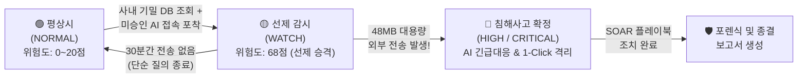
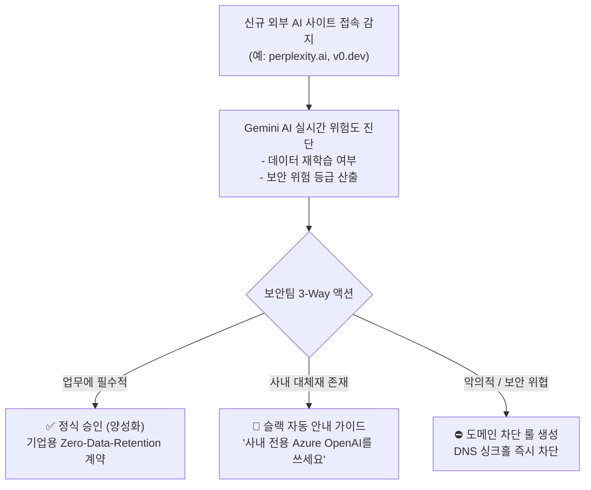

# 🛡️ NexusGuard 엔드투엔드 전체 운영 시나리오 가이드 (Notion 전용)
### Zero Trust 기반 다기종 로그 상관분석 & 섀도우 AI 거버넌스 플랫폼

> 💡 **Notion 활용 팁**:  
> 본 마크다운 문서는 노션(Notion)에 그대로 복사(`Ctrl + C`)하여 붙여넣기(`Ctrl + V`)하면 **콜아웃(Callout), 토글, 데이터 테이블, 시퀀스 다이어그램(Mermaid)**이 완벽하게 자동 변환되어 적용됩니다. 팀 보고서, 발표 대본, 최종 심사 포트폴리오로 바로 활용하실 수 있습니다.

---

## 📌 0. 한눈에 보는 NexusGuard 세계관 요약

> 🚨 **보안 업계의 치명적인 딜레마: "사후 약방문"**  
> "기존 SIEM/보안 관제는 이미 기밀 데이터 수십 기가가 다 털려 나간 뒤에야 붉은 경고창을 띄웁니다. 반대로 DLP/망분리는 직원들의 정상적인 업무(ChatGPT 활용 등)까지 무조건 다 막아버려 업무 마비를 초래합니다."

NexusGuard는 이 문제를 **"사전 선제 감시(WATCH) ➔ 실제 유출 시 AI 즉시 대응(HIGH) ➔ 오탐 시 시스템 자가 치유(NORMAL)"**라는 3단계 동적 라이프사이클로 해결합니다.



---

## 👥 1. 시나리오 무대 및 핵심 등장인물

| 인물 / 자산 | 식별 정보 (ID / IP) | 역할 및 행위 설명 |
| :--- | :--- | :--- |
| **마케팅팀 김대리** | `kim_marketing`<br>(IP: `192.168.10.45`) | 업무를 빨리 끝내려고 사내 고객 DB를 조회한 뒤 외부 ChatGPT에 통째로 올려 분석하려는 내부 직원 |
| **사내 고객 기밀 DB** | `customer_vault`<br>(IP: `10.0.3.50`) | 금융 고객 개인정보 2.4만 건(이름, 주민번호, 연봉, 계좌번호)이 저장된 1급 보안 자산 |
| **외부 생성형 AI** | `api.openai.com`<br>(ChatGPT / OpenAI) | 사내 IT 보안팀의 정식 승인을 받지 않은 미승인 외부 SaaS (Shadow AI) |
| **NexusGuard 시스템** | 중앙 수집 & 상관분석 엔진<br>(Railway + SQLite + Gemini) | 김대리의 단말기, DB 감사 로그, 방화벽 트래픽을 실시간 교차 검증하는 보안 관제 플랫폼 |
| **보안관제 박팀장** | SOC 관제 운영자 | 대시보드를 통해 실시간 위협을 모니터링하고 AI 브리핑을 받아 1-Click으로 조치하는 관리자 |

---

## 🎬 2. 메인 시나리오: "김대리의 초특급 생성형 AI 기밀 유출 사건"

### 🔹 [Phase 0] 평온한 오전 09:00 — 정상 업무 (`NORMAL` 상태)
* **상황**: 김대리가 PC(`DESKTOP-OF0CMDB`)를 켜고 사내 포털에 로그인하여 정상 업무를 시작합니다.
* **시스템 동작**:
  * 단말의 `NexusGuardAgent.exe`가 백그라운드에서 주기적으로 DNS 질의와 웹 접근 이벤트를 수집하여 Railway 중앙 서버로 전송합니다.
  * 김대리의 계정 상태는 **`🟢 NORMAL (위험 점수: 15점)`**이며, 관제 화면 상단 카운터에 평온하게 유지됩니다.

---

### 🔹 [Phase 1] 오후 14:00 — 위험의 서막, 선제적 감시 발동 (`WATCH` 승격) ⭐
> 💡 **"아직 데이터는 나가지 않았다! 그런데 왜 경보가 울릴까?"**

* **김대리의 행동**:
  1. `14:00:10` — 사내 기밀 DB에 접근하여 고객 2.4만 명의 민감 정보 추출:  
     `SELECT customer_name, rrn, phone, annual_income FROM customer_vault;`
  2. `14:05:22` — 크롬 브라우저를 열고 미승인 생성형 AI 사이트인 `chatgpt.com`(`api.openai.com`)에 접속.
* **NexusGuard의 교차 상관분석(Correlation)**:
  * **조건 A**: 최근 15분 이내에 사내 핵심 기밀 DB(`customer_vault`) 대량 조회 이력 존재.
  * **조건 B**: 직후 외부 미승인 Shadow AI(`chatgpt.com`) 도메인 접속 발생.
  * **엔진 판정**: *"기밀을 조회한 직후 허가되지 않은 AI 사이트에 접속했다. 유출 준비 단계일 확률 90% 이상!"*
* **실시간 시스템 반응**:
  * 김대리의 상태가 즉시 **`🟡 WATCH (위험 점수: 68점)`**으로 선제 승격됩니다.
  * 영속 DB(`risk_history`)에 감사 이력 자동 기록:  
    `[14:05:22] kim_marketing | NORMAL ➔ WATCH | 사내 기밀 DB 조회 선행 후 미승인 AI 접속`
  * 대시보드 최상단 **실시간 감사 트레일 Ticker**에 노란색 경고가 점등되며 관제사에게 사전 주의를 환기합니다.

<aside>
💡 <b>[쉬운 비유] 은행 금고와 수상한 가방</b><br>
은행원이 은행 금고 안쪽 깊숙한 곳에서 현금 다발(기밀 DB)을 꺼냈습니다. 그리고 바로 은행 뒷골목의 불법 환전소(미승인 AI) 문을 열고 들어갔습니다.<br>
아직 돈을 건네주지 않았더라도, 경비원(NexusGuard)은 이 사람을 당장 <b>'요주의 감시 대상(WATCH)'</b>으로 등록하고 주시해야 합니다. 기존 보안 장비는 돈을 다 건네주고 난 뒤에야 알람을 울렸지만, NexusGuard는 문을 여는 순간 이미 감시를 시작합니다.
</aside>

---

### 🔹 [Phase 2] 오후 14:08 — 기밀 유출 확정 (`HIGH / CRITICAL` 폭발)
> 🚨 **"48MB의 거대한 파일이 외부 AI 서버로 발사되다!"**

* **김대리의 행동**:
  * `14:08:30` — DB에서 내려받은 2.4만 건의 고객 정보 CSV와 하반기 전략기획서 PPT를 합쳐 압축한 파일(`customer_summary.zip`)을 ChatGPT 프롬프트 입력창에 첨부하여 업로드(`POST`)합니다.
* **원천 로그 수집**:
  * 네트워크 방화벽/프록시 로그: `api.openai.com:443`, 전송 바이트 `bytes_sent: 48,291,040 (약 48MB)`.
* **엔진 판정 & 인시던트 확정**:
  * 김대리는 이미 **`WATCH`** 상태였습니다. 평소 텍스트 질문(수 KB) 수준이 아닌, **48MB 대용량 파일 전송**이 발생했습니다!
  * 위험 점수 즉시 **`🔴 92점 (HIGH 인시던트)`** 폭발 ➔ 인시던트 코드 `INC-SEC-015` 정식 발령.

<aside>
🔍 <b>[기술 질문] 왜 하필 용량이 '48MB'인가요?</b><br>
<b>1. 현실적인 기밀 데이터 크기</b>: 고객 개인정보 2~5만 건 CSV(약 5~10MB)에 고해상도 마케팅 기획 PPT(30~40MB)를 묶으면 전형적인 40~50MB 패킷이 형성됩니다.<br>
<b>2. 챗봇 질문 vs 파일 업로드의 결정적 차이</b>: 일반적인 텍스트 프롬프트 질의는 아무리 길어도 수십 KB에 불과합니다. 단일 HTTP POST 페이로드가 48MB라는 것은 100% 파일 첨부 업로드임을 기술적으로 방증합니다.<br>
<b>3. 플랫폼 임계치</b>: OpenAI/ChatGPT의 단일 파일 업로드 권장 제한선(약 50MB) 직전에 해당하는 수치로, 악의적/부주의한 내부자가 한 번에 올릴 수 있는 최대치의 기밀 반출 시나리오를 정밀하게 재현한 것입니다.
</aside>

* **대시보드 실시간 표출**:
  * **네트워크 토폴로지 킬체인 연결**: `김대리 PC ➔ 고객 DB ➔ 외부 OpenAI 서버` 3개 노드가 붉은색 공격선으로 연결.
  * **Gemini AI 자동 브리핑 생성**:
    > *"마케팅팀 김대리(192.168.10.45) 단말에서 14:00경 customer_vault DB 대량 조회 후, 비인가 OpenAI API로 48.2MB 데이터 유출이 확정되었습니다. MITRE ATT&CK T1567(Exfiltration Over Web Service)에 해당하며 즉시 단말 격리가 필요합니다."*

---

### 🔹 [Phase 3] 오후 14:09 — SOAR 원클릭 긴급 보안 조치 및 차단
> ⚡ **"관제사는 당황하지 않고 버튼 하나만 누릅니다."**

관제 대시보드 하단에 활성화된 **`[SOAR 원클릭 긴급 대응]`** 버튼을 클릭하면, 백엔드에서 3대 차단 조치가 1초 만에 실행됩니다:

1. **단말 네트워크 즉각 격리**:
   * Windows Defender Firewall / EDR API를 통해 김대리 PC의 모든 외부 통신을 즉시 드롭(`Drop all outbound except SOC`).
2. **사내 DNS 싱크홀 차단**:
   * 전사 DNS/방화벽에 `api.openai.com` 및 목적지 IP를 블랙리스트(`0.0.0.0`)로 자동 등록.
3. **Active Directory 계정 즉시 잠금**:
   * 김대리의 사내 계정 세션을 즉시 만료시키고 로그인 차단(`Disable-ADAccount`).
4. **보안팀 슬랙(Slack) 긴급 알림 전송**:
   * 웹훅을 통해 침해사고 요약본과 차단 결과가 관제 채널에 자동 브로드캐스팅.

---

## ⏱️ 3. 예외 및 자가 치유 시나리오 (Edge Cases)

### 🌿 시나리오 A: 오탐 자가 치유 (Self-Healing TTL)
> **"김대리가 DB를 보고 나서, 단순 영어 이메일 문법 하나만 질문하고 껐다면?"**

* **상황**:
  * 14:05에 기밀 DB 조회 후 ChatGPT에 접속하여 `WATCH` 상태(68점)로 승격되었습니다.
  * 하지만 김대리는 기밀을 올리지 않고 "회의 일정 영어 메일 양식 알려줘"라는 간단한 질문만 한 뒤 창을 닫았습니다.
* **시스템의 동작**:
  * 시스템은 `WATCH` 상태에 **30분 만료 타이머(TTL, Time-To-Live)**를 부여합니다.
  * 14:05부터 14:35까지 30분 동안 외부로 대용량 전송이 단 1건도 발생하지 않았습니다.
  * 14:35:00 타이머가 만료되는 순간, 엔진이 자동으로 상태를 **`🟢 NORMAL (15점)`**으로 안전하게 복구합니다.
  * 영속 DB 기록:  
    `[14:35:00] kim_marketing | WATCH ➔ NORMAL | 30분 무전송 만료(TTL)로 인한 정상 자가 치유`
* **도입 효과**:
  * 기존 보안 관제는 오탐 알람이 하루 수천 건씩 쌓여 관제사를 지치게 만들었지만(Alert Fatigue), NexusGuard는 시스템이 알아서 무해한 상황을 판정하고 스스로 청소합니다.

---

### 🥷 시나리오 B: 잠복형 유출 (Dormant Exfiltration) ⭐
> **"30분이 지나 NORMAL로 풀렸는데... 3시간 뒤 야간에 갑자기 대용량을 쏜다면?"**

많은 심사위원과 보안 전문가가 던지는 가장 날카로운 질문입니다:  
*"30분 지나서 정상으로 풀리는 걸 악용해서, 일부러 1시간 기다렸다가 유출하면 안 잡히나요?"*

**NexusGuard는 이 잠복형 유출을 완벽하게 잡아냅니다.**

<aside>
🎰 <b>[쉬운 비유] 카지노의 블랙리스트 이력 추적</b><br>
카지노에서 한 손님이 칩을 주머니에 슬쩍 넣는 것 같아서 가드가 30분간 주시했습니다. 30분 동안 얌전히 있길래 감시를 풀었습니다.<br>
그런데 3시간 뒤, 그 손님이 환전 창구가 아닌 비상구 문을 부수고 거대한 자루를 들고 뛰쳐나갑니다.<br>
경비원은 "어? 지금은 감시 대상 아니니까 일반 손님이네?" 하고 보내줄까요? <b>절대 아닙니다!</b> "저 사람 아까 30분 동안 요주의 인물(WATCH)로 등록됐던 그 놈이다!"라며 즉시 비상벨을 울립니다.
</aside>

* **기술적 2중 그물망 구조**:
  1. **1단계: 단독 대용량 이상 징후 탐지 (Standalone Outbound Spike)**
     * 김대리의 현재 상태가 설령 `NORMAL`이라 하더라도, 사전 승인되지 않은 외부 IP로 갑자기 수십 MB의 트래픽 스파이크가 발생하면 엔진 내 독립 이상치 탐지 모듈이 즉각 경보를 발생시킵니다.
  2. **2단계: 과거 24시간 감사 이력 교차 추적 (`has_user_prior_watch_history`)**
     * 엔진은 즉시 영속 DB(`risk_history`)를 조회합니다:  
       `"이 사용자, 최근 24시간 내에 WATCH(사전 감시)로 지정된 적이 있었는가?"`
     * **판정**: 김대리는 3시간 전 고객 DB를 열람하여 `WATCH` 상태에 올랐던 이력이 명백히 기록되어 있습니다.
     * **결과**: 단순 트래픽 이상치가 아닌 **'지연 잠복형 기밀 유출(INC-DORMANT)'**로 즉시 판정하여 점수를 92점(`HIGH/CRITICAL`)으로 직행시키고 차단합니다!

---

## 🤖 4. 사내 섀도우 AI & IT 거버넌스 활용법
> **"무조건 막는 것은 보안이 아니다. 쓸 수 있는 안전한 길을 열어주어라."**

보안팀이 모든 AI 사이트를 막아버리면 직원들은 스마트폰 테더링이나 개인 노트북으로 몰래 사용합니다(풍선 효과). NexusGuard의 거버넌스 탭은 이를 **"양성화"**합니다.



### 📋 거버넌스 관리 화면 3대 기능
1. **Gemini AI 즉시 진단기**:
   * 직원이 새로운 AI 도구(`perplexity.ai`, `gamma.app`)에 접속하면, Gemini LLM이 해당 서비스의 이용약관과 데이터 재학습 정책을 실시간 분석하여 위험도를 즉시 제시합니다.
2. **사내 대체 도구 추천**:
   * 위험한 외부 무료 AI 대신, 회사가 이미 구독 중인 보안 AI(예: 사내 프라이빗 ChatGPT, Enterprise Claude)를 자동으로 매핑해 줍니다.
3. **1-Click 양성화 / 슬랙 가이드 발송**:
   * 버튼 클릭 한 번으로 사내 화이트리스트에 등록하거나, 해당 부서 직원들에게 슬랙 DM으로 안전한 사용 가이드를 자동 배포합니다.

---

## 📡 5. 엔지니어링 파이프라인: "팀원 에이전트부터 대시보드까지"

NexusGuard는 단순 목업(Mockup)이 아닌, 실제 동작하는 파이프라인입니다.

```
[팀원 윈도우 PC] 
   └── NexusGuardAgent.exe (DNS 및 웹 접속 감지)
          ↓ (암호화 HTTPS POST 통신)
[클라우드 중앙 수집 서버] (Railway Cloud / Flask + PostgreSQL)
          ↓ (실시간 JSON 폴링 & 스트리밍)
[NexusGuard 코어 엔진] (correlation.py & sqlite_store.py)
   ├── 1. Unified JSON 정규화
   ├── 2. 상태 머신 (NORMAL ➔ WATCH ➔ HIGH ➔ 자가치유)
   ├── 3. Gemini AI 실시간 진단 및 브리핑
          ↓
[Streamlit 대시보드]
   ├── 종합 관제 (실시간 Ticker & 위험도 현황)
   ├── 킬체인 분석 (D3/SVG 네트워크 토폴로지)
   ├── AI·IT 거버넌스 (자산 관리 & 양성화)
   └── 중앙 서버 파이프 라인 (수집 현황 모니터링)
```

* **보안 강화 조치**:
  * Railway API Key 및 Gemini API Key는 프론트엔드 및 문서에 절대 노출되지 않도록 `.env` 환경 변수(`RAILWAY_API_KEY`, `GEMINI_API_KEY`)로 안전하게 격리되었습니다.
  * UI에서는 안전하게 인증되었음을 알리는 **`● VERIFIED`** 보안 배지만 표시됩니다.

---

## 🎤 6. 발표 및 최종 평가 대비 1분 핵심 스피치 대본

```text
"존경하는 심사위원 여러분,
저희 NexusGuard를 한 문장으로 정의하면,
'데이터가 털리기 전에 먼저 감시하고, 실제 유출 시 AI가 즉시 대응하며, 정상 업무는 스스로 자가 치유하는 시스템'입니다.

화면을 보시겠습니다.
마케팅팀 김대리가 고객 DB를 조회하고 미승인 AI에 접속하는 순간,
아직 데이터가 단 1바이트도 나가지 않았음에도 NexusGuard는 즉시 'WATCH' 상태로 선제 승격시킵니다.
상단 감사 트레일에 실시간으로 기록되는 것을 확인하실 수 있습니다.

이 상태에서 실제로 48MB의 기밀 파일 업로드가 시도되면 즉시 'HIGH' 인시던트로 확정되고,
Gemini AI가 침해사고 요약 브리핑과 1-Click 격리 플레이북을 제시합니다.

반대로 단순 질문 후 창을 닫았다면, 30분 뒤 시스템이 스스로 정상(NORMAL)으로 안전하게 복귀시킵니다.
만약 이 30분을 피해 나중에 유출을 시도하더라도, 과거 24시간 감사 이력을 추적하여 잠복형 유출까지 완벽하게 적발합니다.

사후 약방문에 그치던 기존 보안 관제의 한계를 넘어선, 진정한 Zero Trust 차세대 XDR 플랫폼입니다."
```

---

## 🏆 7. 심사위원 예상 질문 및 모범 답변 (Q&A 치트키)

**Q1. 기존 EDR이나 DLP 솔루션과 비교했을 때 NexusGuard만의 결정적인 차별점은 무엇인가요?**
> **답변**: 기존 DLP는 사내 업무망 전체의 AI 접속을 차단하여 업무 생산성을 심각하게 떨어뜨리고, SIEM은 유출이 끝난 수 시간 뒤에야 로그를 취합해 알려줍니다. NexusGuard는 **'기밀 DB 조회'와 '미승인 SaaS 접속'을 시간 축으로 실시간 교차 검증**하여, 평소에는 직원의 AI 활용을 보장하다가 기밀 접촉 직후에만 동적으로 '선제 감시(WATCH)' 모드를 켜는 Zero Trust 적응형 보안을 실현했습니다.

**Q2. 30분 TTL 자가 치유 후 나중에 유출을 시도하는 지연 공격(Dormant Attack)은 어떻게 막나요?**
> **답변**: 시스템의 상태가 NORMAL로 복귀했더라도, SQLite 기반의 `risk_history` 감사 테이블에 24시간 동안 과거 WATCH 승격 이력이 영속적으로 보존됩니다. 따라서 단독 트래픽 스파이크 발생 시 과거 이력을 즉각 질의(`has_user_prior_watch_history`)하여 즉시 HIGH/CRITICAL 등급의 잠복형 침해사고로 승격시켜 차단합니다.

**Q3. 외부 미승인 AI 사이트가 매일 수십 개씩 새로 생겨나는데 어떻게 다 분류하나요?**
> **답변**: 구글 Gemini LLM 기반의 실시간 도메인 진단 엔진을 연동했습니다. 관리자가 사전에 룰셋을 등록하지 않은 생소한 도메인이라도, 접속 즉시 Gemini가 해당 사이트의 서비스 성격과 데이터 재학습 여부를 판별하여 위험도를 분류하고 사내 대체재를 추천해 줍니다.
