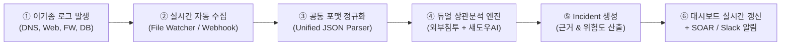
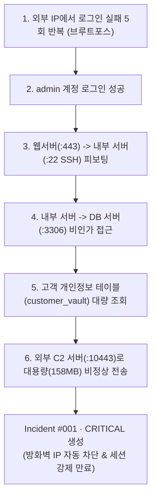
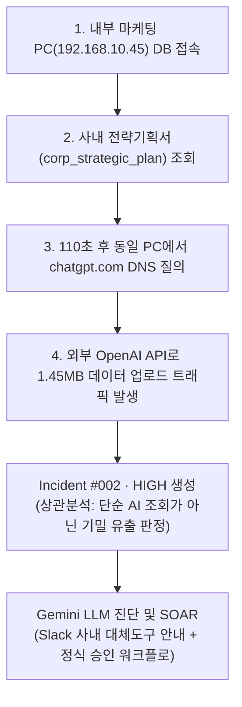

# 🛡️ NexusGuard (넥서스가드) 프로젝트 기획안
### Zero Trust 기반 다기종 로그 상관분석 & 섀도우 AI·IT 거버넌스 자동화 플랫폼

> **프로젝트 명:** NexusGuard (넥서스가드)  
> **과정 구분:** SKT ALEPH 5개 과목 통합 캡스톤 프로젝트  
> **팀 구성:** 4명 (전원 Day 1부터 병렬 개발)  
> **개발 기간:** 6주 (3주차 MVP 완성)  
> **상태:** 통합 기획 완료 · 팀 검토용

---

<aside>
🛡️

**한 줄로 말하면:** 서버·DB·방화벽 로그와 사내 DNS 질의를 실시간으로 자동 수집하여, 외부 해커의 내부 침투(Lateral Movement)와 내부 직원의 섀도우 AI(ChatGPT 등)를 통한 기밀 유출을 동시에 상관분석하고, LLM 기반 양성화 및 자동 대응(SOAR)을 제공하는 통합 관제 시스템이다.

</aside>

---

## 1. 왜 두 프로젝트를 하나로 합쳤는가? (기획 배경)

기존에 검토하던 두 기획은 각자 뛰어났지만, 명확한 한계가 있었습니다.

| 구분 | [후보 1] 네트워크 상관분석 | [후보 2] 섀도우 IT·AI 탐지 | **[통합안] NexusGuard** |
| :--- | :--- | :--- | :--- |
| **핵심 장점** | 킬체인 추적, 높은 기술적 깊이 | 섀도우 AI 최신성, 1주차 빠른 결과 | **기술적 깊이 + 최신 AI 거버넌스 결합** |
| **치명적 한계** | 3주차까지 화면이 안 떠서 불안함 | DNS만으로는 기밀을 올렸는지 모름 | **1주차에 화면 도출 + DB 로그 교차검증** |
| **접근통제(3과목)**| 비중 다소 낮음 | 비중 다소 낮음 | **Zero Trust 동적 권한/승인선 전면 보강** |

### 💡 융합이 만들어낸 결정적 시너지 ($1 + 1 = 3$)
> **"직원이 `chatgpt.com`에 접속한 DNS 로그(후보 2)와 직전에 사내 DB에서 고객정보를 대량 조회한 감사 로그(후보 1)를 상관분석(Correlation)으로 연결하면, 기업들이 가장 두려워하는 '생성형 AI를 통한 기업 기밀 유출 킬체인'을 실시간으로 포착할 수 있다."**

---

## 2. 우리가 만들려는 것 — 전체 자동화 흐름

사람이 로그 파일을 수동으로 업로드하는 프로그램이 아닙니다.  
**백그라운드에서 실시간으로 수집부터 분석, 대시보드 갱신까지 무중단으로 동작**합니다.



```
[로그 발생] (DNS, Auth, 방화벽, DB)
   ↓ 자동
[로그 수집] (dnsmasq, File Watchdog)
   ↓ 자동
[정규화] (모든 로그를 단일 표준 JSON으로 번역)
   ↓ 자동
[상관분석] (외부 침투 홉 추적 + 내부 섀도우 AI 유출 교차검증)
   ↓ 자동
[Incident 생성] (판단 근거 4~5개 자동 도출, 신뢰 점수 산출)
   ↓ 자동
[대시보드 갱신 & SOAR] (네트워크 맵 표시, 방화벽 차단 및 Slack 알림)
```

---

## 3. 핵심 시나리오 2종 (트윈 시나리오)

처음부터 수십 개의 공격을 다루지 않습니다. **기업 보안의 양대 축인 2개 시나리오**를 완벽히 관통합니다.

### 시나리오 A. [외부 위협] 계정 탈취 및 내부 측면이동(Lateral Movement) 킬체인
외부 공격자가 내부망을 타고 들어가 핵심 DB를 탈취하는 과정을 네트워크 토폴로지 맵으로 추적합니다.



### 시나리오 B. [내부 위협] 섀도우 AI 접속 및 기밀 데이터 유출 복합 탐지
내부 직원이 사내 DB 데이터를 생성형 AI(ChatGPT 등)에 붙여넣어 유출하는 행위를 교차 검증합니다.



---

## 4. 프로젝트의 핵심 — 상관분석(Correlation) 판단 기준

단순히 로그를 한곳에 모으는 것이 아니라, **서로 다른 로그를 왜 하나의 사건으로 묶었는지 설명 가능한 근거(Explainable Evidence)**를 산출합니다.

| 판단 기준 | 쉽게 설명하면 | 배점 |
| :--- | :--- | :---: |
| **동일 사용자/계정** | 같은 계정(`admin`, `user01`)에서 이어진 행동인가? | **+2점** |
| **동일 IP / 서브넷** | 동일한 단말 또는 동일 네트워크 대역에서 발생했는가? | **+2점** |
| **시간 근접성** | 10분 이내의 슬라이딩 윈도우 안에 연속으로 일어났는가? | **+2점** |
| **네트워크 홉 연속성** | 앞선 이벤트의 목적지(`dst_ip:port`)가 다음 이벤트의 출발지(`src_ip`)로 이어지는가? | **+2점** |
| **공격 시퀀스 일치** | 공격 킬체인 또는 데이터 유출 시퀀스 순서와 일치하는가? | **+4점** |

> **오탐 방지 앵커(Anchor) 원칙:**  
> 단순히 시간만 가깝다고 로그를 묶지 않습니다. 반드시 **`동일 계정` 또는 `네트워크 홉 연속성`이 1개 이상 성립**할 때만 점수를 누적하여 정상 업무 로그의 오결합(Over-grouping)을 차단합니다.

---

## 5. 섀도우 IT·AI 대응 철학: "무조건 차단"이 아닌 "양성화"

<aside>
🎯

**"막는 도구가 아니라, 찾아서 통제권 안으로 양성화(Sanctioning)하는 도구입니다."**

</aside>

* **무조건 차단할 경우:** 직원의 46%는 개인 스마트폰/테더링으로 우회 사용 $\rightarrow$ 사내망을 벗어나 관제 사각지대 발생
* **양성화 워크플로:**
  1. DNS로 미승인 AI 도메인 감지
  2. **Google Gemini LLM**이 도메인 성격 및 데이터 재학습 위험도 분석
  3. 사용 직원에게 Slack 알림 발송: *"사내 보안 규정에 따라 사내 프라이빗 AI 포털을 이용해 주세요."*
  4. 보안팀 대시보드에서 **[정식 엔터프라이즈 라이선스 승인]** 또는 **[차단]** 원클릭 결정

---

## 6. 공통 데이터 표준 스키마 (Unified JSON)

서로 다른 로그를 단일 표준으로 번역하여 상관분석 엔진에 공급합니다.

```json
{
  "event_id": "EVT-20260904-00108",
  "timestamp": "2026-09-04T10:05:33Z",
  "log_source": "dns | auth | firewall | db | web",
  "actor": {
    "user_id": "admin",
    "src_ip": "10.0.0.10",
    "src_port": 53120
  },
  "target": {
    "dst_ip": "10.0.0.20",
    "dst_port": 22,
    "domain": "chatgpt.com",
    "hostname": "internal-core-01"
  },
  "action": "ALLOW | DENY | LOGIN_SUCCESS | SELECT | QUERY",
  "payload": {
    "query_string": "SELECT * FROM customer_vault",
    "bytes_sent": 158000000,
    "category": "LateralMovement"
  }
}
```

---

## 7. 우리가 웹에서 보게 될 화면

대시보드는 **다크 사이버 관제 스타일**로 구성되며, 최소한 다음 5개 핵심 영역을 제공합니다.

| 영역 | 무엇을 보여주나? |
| :--- | :--- |
| **KPI 요약 카드** | 전체 인시던트 수, CRITICAL / HIGH 개수, 섀도우 AI 탐지 자산 수 |
| **최근 인시던트 목록** | 최근 발생한 사건, 위험도 칩, 클릭 시 상세 연동 |
| **공격 흐름 타임라인** | 로그인 실패 $\rightarrow$ 성공 $\rightarrow$ SSH 피보팅 $\rightarrow$ DB 접근 $\rightarrow$ 유출 시퀀스 |
| **네트워크 토폴로지 맵** | Internet $\rightarrow$ Web(:443) $\rightarrow$ Internal(:22) $\rightarrow$ DB(:3306) 공격 이동 경로 하이라이트 |
| **섀도우 AI 관리 카드** | 도메인별 사용자 수, Gemini AI 진단 소견, [양성화 승인], [Slack 안내], [차단] 버튼 |

> **UI 기술 스택 전략:**  
> - **1주차:** Streamlit으로 빠른 프로토타입을 제작하여 팀의 심리적 안정감 확보  
> - **4주차 이후 (선택):** 실시간 깜빡임 없는 관제를 위해 `FastAPI + HTMX + Vis.js (동적 네트워크 맵)`로 고도화 가능

---

## 8. 4명 역할 분담 — 전원 첫날부터 병렬 개발

공통 스키마(`schema.json`)를 먼저 합의했기 때문에, **한 사람의 작업이 끝날 때까지 기다리지 않고 4명이 동시에 시작**합니다.

| 담당 | 주요 업무 | 아주 쉽게 말하면 | 첫날부터 할 수 있는 일 |
| :--- | :--- | :--- | :--- |
| **① 인프라·로그 수집** | Docker (dnsmasq, Web, DB), 원천 로그 생성기, File Watchdog | 로그가 생기고 들어오는 길 만들기 | Docker 환경 구성, 시나리오 A/B 더미 로그 작성 |
| **② 로그 파싱·정규화** | 이기종 로그를 공통 JSON으로 변환하는 파서 모듈 개발 | 제각각인 로그를 같은 모양으로 정리 | Regex 파서 함수 작성 및 예외 로그 격리 |
| **③ 분석·상관분석** | 듀얼 상관분석 엔진, 점수 산출, Gemini LLM 도메인 판별 | 어떤 행동들이 같은 사건인지 판단 | 슬라이딩 윈도우 알고리즘, LLM 프롬프트 작성 |
| **④ 대시보드·SOAR** | 웹 대시보드(KPI, 킬체인, 네트워크 맵, 섀도우 AI 카드), Slack 알림 | 결과를 눈에 보이게 만들기 | 가짜 Incident 데이터로 웹 화면 제작 |

---

## 9. 6주 로드맵 & 3주차 MVP 목표

| 주차 | 목표 | 눈에 보여야 하는 결과 |
| :--- | :--- | :--- |
| **1주차** | 기획 확정 + 스키마 정의 + Mock UI | **가짜 로그/인시던트가 웹 화면에 정상적으로 뜸** |
| **2주차** | 로그 자동 수집 + 정규화 파서 | 새 로그 텍스트가 공통 JSON으로 자동 변환됨 |
| **3주차 (MVP)** | **탐지 + 듀얼 상관분석 E2E 관통** | **시나리오 A(외부침투) & B(AI유출)가 웹 화면에 자동 갱신** |
| **4주차** | 알고리즘 고도화 & 네트워크 맵 | 왜 같은 사건인지 판단 근거 및 토폴로지 경로 표시 |
| **5주차** | Zero Trust 승인센터 & SOAR 연동 | Slack 알림 발송 및 원클릭 방화벽 차단/양성화 작동 |
| **6주차** | 통합 테스트 + 모의 시연 + 최종 발표 | 공격 시나리오 실행 시 실시간 관제 시연 |

<aside>
🎯

**첫 번째 3주차 MVP 목표:**  
인증+방화벽+DB 로그와 DNS 로그를 수집하여, 외부 침투 Incident 1건과 섀도우 AI 유출 Incident 1건이 웹 대시보드에 자동으로 생성되는 E2E 파이프라인을 완성한다.

</aside>

---

## 10. SKT ALEPH 5개 과목 100% 매핑

두 기획안의 공통 약점이었던 **3과목(접근통제)**을 완벽히 보강했습니다.

| 과목 | NexusGuard 내 구현 요소 | 비중 |
| :--- | :--- | :---: |
| **1과목 AI·자동화** | Gemini LLM 기반 미등록 도메인 판별 및 권고문 자동 생성 | ★★★ |
| **2과목 네트워크·ZT** | DNS 질의 분석(Day3), 내부 피보팅 네트워크 경로 추적, Zero Trust 최소 권한 | ★★★ |
| **3과목 접근통제** | **미승인 SaaS/AI 정식 승인 워크플로, 직무 기반(RBAC) 조건부 접근 통제** | **★★★ (보강완료)** |
| **4과목 이상탐지** | 다차원 가중치 상관분석(Day3), 타임윈도우 기반 오탐 튜닝(Day4) | ★★★ |
| **5과목 SOAR** | 방화벽 IP 차단 자동화(Day2), Slack 알림(Day3), 양성화 승인 게이트(Day4) | ★★★ |

---

## 11. 면접 및 최종 평가 필살기 Q&A (3선)

### Q1. "두 가지 기능을 합쳤는데 너무 산만하지 않나요?"
> **답변:** "산만하게 나열한 것이 아니라 **'사내 핵심 데이터의 유출 경로'라는 단 하나의 관점으로 통합**했습니다. 해커가 외부에서 침투하여 DB를 털어가는 경로(외부 킬체인)와 내부 임직원이 미인가 생성형 AI로 데이터를 반출하는 경로(섀도우 AI 유출)는 오늘날 기업이 마주한 양대 위협입니다. 저희는 이를 '이기종 로그 상관분석'이라는 단일 아키텍처로 우아하게 통합했습니다."

### Q2. "이거 이미 SIEM이나 CASB에 있는 기술 아닌가요?"
> **답변:** "맞습니다. 다만 상용 솔루션을 그대로 모방하는 것이 아니라, **'도대체 서로 다른 로그를 무슨 기준으로 엮어야 진정한 침해사고가 되는가?'**라는 상관분석의 근본 메커니즘을 직접 설계했습니다. 또한 고가의 CASB를 도입하기 어려운 환경을 고려해, DNS라는 가장 보편적인 신호와 LLM을 결합하여 비용 효율적인 거버넌스 대안을 제시했습니다."

### Q3. "DNS 로그만으로 데이터 유출을 어떻게 입증하나요?"
> **답변:** "그것이 기존 섀도우 IT 도구의 한계였습니다. 저희는 **DNS 질의 전후의 DB 감사 로그(SELECT 민감정보)와 아웃바운드 트래픽 볼륨을 교차 상관분석**했습니다. 직전에 대량의 기밀 조회가 있었는지, 그리고 실제 외부 전송 트래픽이 급증했는지를 함께 검증함으로써 오탐 없는 확실한 유출 증거를 제시합니다."

---

## 12. 당장 오늘 팀이 할 일 (Action Items)

- [ ]  팀 회의: 본 통합 기획안(`NexusGuard`)으로 최종 확정
- [ ]  4인 역할 배정 확정 (①인프라, ②파서, ③상관분석/LLM, ④대시보드)
- [ ]  GitHub 저장소 생성 및 `nexusguard/` 폴더 구조 공유
- [ ]  공통 데이터 스키마(`schemas/event.py`) 검토
- [ ]  1주차 프로토타입 화면(`streamlit run nexusguard/ui/app.py`) 각자 실행해 보고 확인
- [ ]  Google Gemini API 키 발급 담당자 지정
