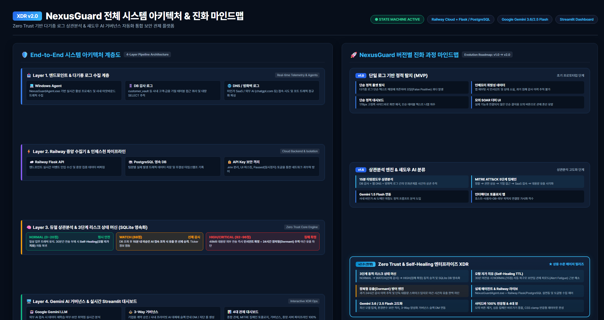
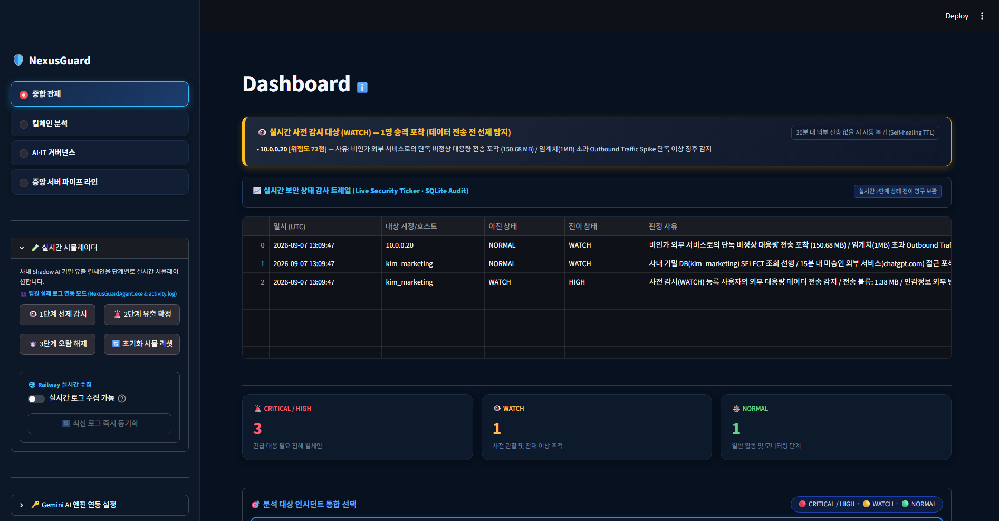
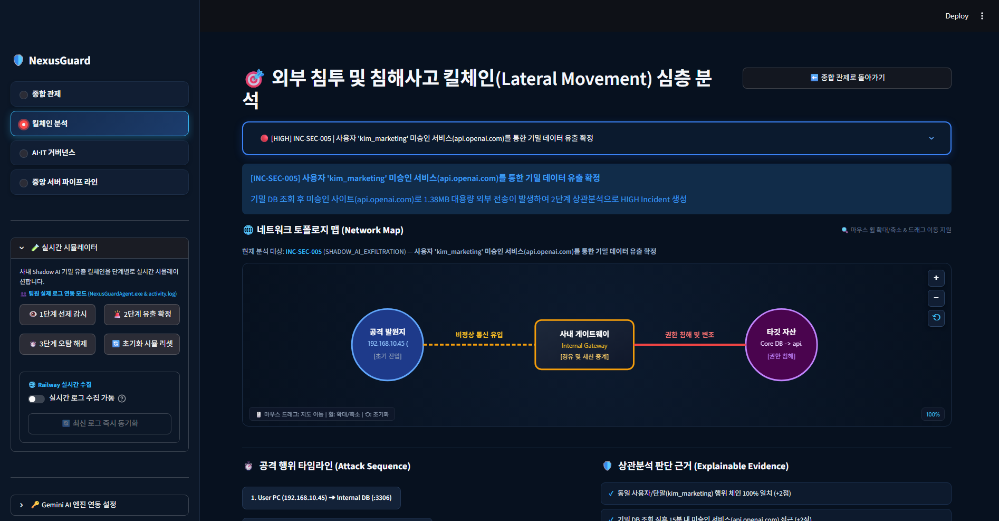
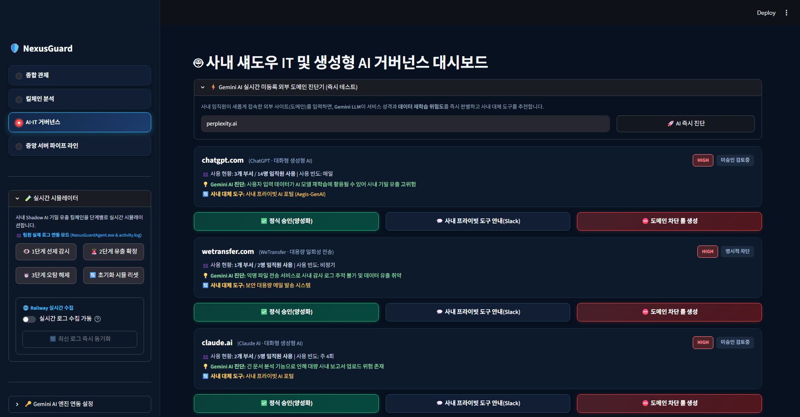
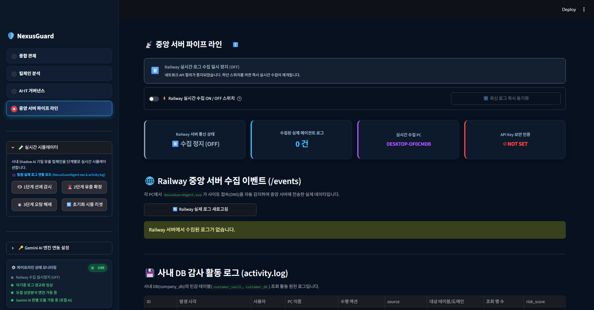
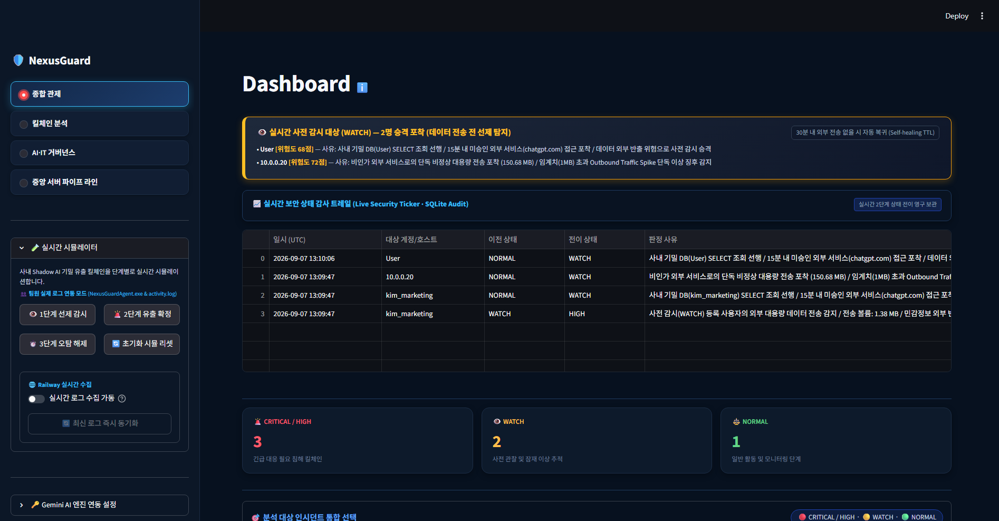
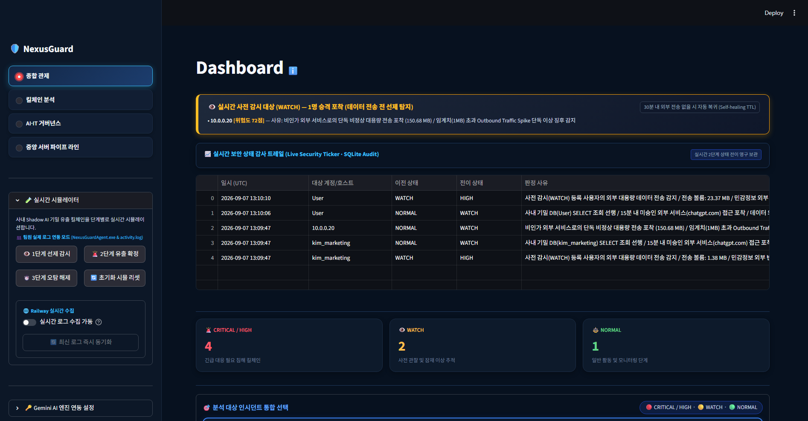
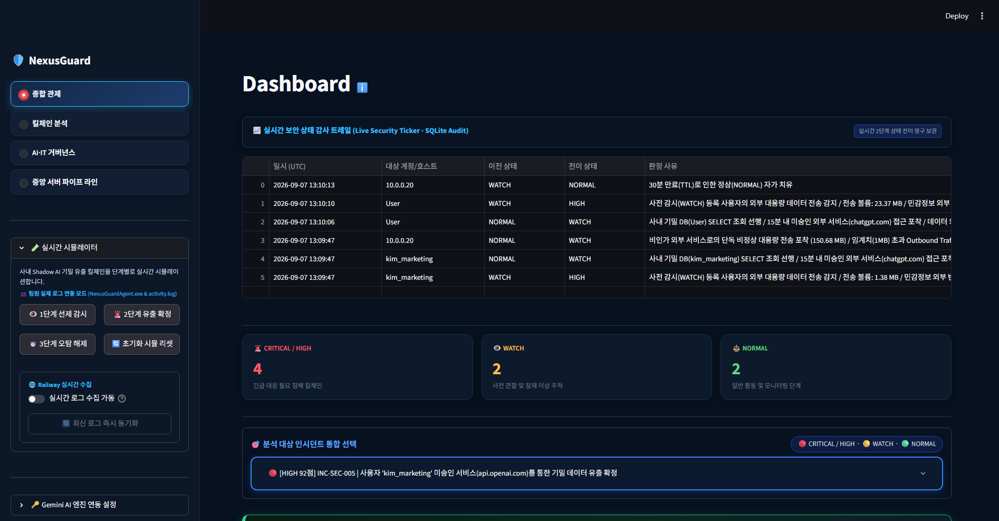

# 🛡️ NexusGuard (넥서스가드) v2.0
> **Zero Trust 기반 다기종 로그 상관분석 & 섀도우 AI 거버넌스 자동화 통합 XDR 플랫폼**  
> *Preemptive Risk State Machine, Self-Healing TTL & Shadow AI Sanctioning Engine*

[](https://python.org)
[](https://streamlit.io)
[](https://ai.google.dev/)
[](https://railway.app)
[](https://sqlite.org)
[](LICENSE)

---

## 📌 1. 프로젝트 개요 (Overview)

오늘날 기업 환경에서 **생성형 AI(ChatGPT, Claude, Perplexity 등)의 무분별한 업무 활용(Shadow AI)**은 생산성을 혁신하는 동시에, **사내 핵심 기밀 및 고객 개인정보가 외부 모델로 재학습·유출되는 치명적인 보안 사각지대**를 야기하고 있습니다.

기존 보안 관제(SIEM/방화벽)는:
1. **단순 텍스트 매칭에 의존**하여 하루에도 수만 건의 오탐을 쏟아내고(Alert Fatigue, 관제 피로도),
2. 실제 유출이 발생한 뒤에야 적발하는 **사후 대응의 한계**가 있으며,
3. 보안을 위해 **무조건적인 웹/AI 전면 차단**을 적용하여 현업의 업무 생산성을 심각하게 마비시킵니다.

**NexusGuard(넥서스가드)**는 이 문제를 해결하기 위해 탄생한 **차세대 엔터프라이즈 XDR(Extended Detection & Response) 플랫폼**입니다.  
사내 DB 감사 로그, 웹/DNS 질의, 네트워크 방화벽, 엔드포인트 에이전트 로그를 실시간으로 교차 상관분석하여 **'유출 발생 전 선제 감시(Preemptive WATCH)'**하고, **'오탐은 스스로 치유(Self-Healing)'**하며, **'사후 야간 유출(Dormant Exfiltration)까지 추적'**하고, **'미승인 AI를 정식 양성화(Sanctioning)'**합니다.

---

## 🗺️ 2. 전체 시스템 구조도 & 버전별 진화 마인드맵

NexusGuard의 4-Layer 엔드투엔드 파이프라인 아키텍처와 초기 프로토타입(v1.0)부터 현행 엔터프라이즈 XDR(v2.0)까지의 진화 과정입니다.



### 🏗️ 4-Layer 시스템 파이프라인 구조
1. **📥 Layer 1. 엔드포인트 & 다기종 로그 수집 계층 (Telemetry & Agents)**
   - **Windows Agent (`NexusGuardAgent.exe`)**: 사내 PC의 활성 프로세스 및 외부 아웃바운드 세션 실시간 캡처
   - **DB 감사 로그**: `customer_vault` 등 사내 핵심 기밀 테이블 접근 쿼리 및 대량 SELECT 추적
   - **DNS / 방화벽**: 미인가 SaaS 도메인 질의 및 포트별 네트워크 트래픽 정규화 파싱
2. **⚡ Layer 2. Railway 중앙 수집기 & 인제스천 파이프라인 (Central Pipeline)**
   - **Railway Flask API**: 엔드포인트 수집 데이터의 중앙 인입 수신 및 버퍼링
   - **PostgreSQL 영속 저장소**: 팀원별 실제 발생 트래픽 데이터 저장 및 무결성 타임스탬프 기록
   - **보안 격리**: API Key `.env` 분리, UI 보안 마스킹, 일시정지(Paused) 토글을 통한 네트워크 제어
3. **🧠 Layer 3. 듀얼 상관분석 & 3단계 리스크 상태 머신 (Core Engine)**
   - **3단계 동적 라이프사이클**: `NORMAL` ➔ `WATCH` ➔ `HIGH/CRITICAL`
   - **오탐 자가 치유 (Self-Healing TTL)**: 30분간 추가 전송 없을 시 NORMAL로 자동 복귀
   - **잠복형 유출 방어 (Dormant Protection)**: 과거 24시간 감사 이력 추적(`has_user_prior_watch_history`)
4. **🖥️ Layer 4. Gemini AI 거버넌스 & XDR 대시보드 (Interactive Ops)**
   - **Google Gemini 3.6 / 2.5 Flash**: 외부 AI 접속 시 데이터 재학습 위험도 및 취약점 실시간 진단
   - **3-Way 양성화 거버넌스**: 기업용 승인 / 사내 프라이빗 AI 대체재 슬랙 안내 DM / 차단 룰 생성
   - **Streamlit 관제 콘솔**: 종합 관제, MITRE 킬체인 토폴로지, 실시간 Ticker, 100% 반응형 사이드바

---

## ⚙️ 3. 핵심 보안 탐지 메커니즘 (Core Logic)

```
[평시 NORMAL (0~20점)]
       │
       ▼ (사내 기밀 DB 조회 후 15분 내 미승인 AI 접속 포착)
[선제 감시 WATCH (68점)] ──(30분간 외부 대용량 전송 없음)──► [Self-Healing: NORMAL 복귀 (15점)]
       │                                                                  │
       ▼ (48MB 대용량 외부 전송 발생)                                     │ (야간 시간차 전송 시도)
[침해 확정 HIGH (92~96점)] ◄───[과거 24시간 감사 이력 추적으로 즉각 적발]───────┘
```

| 탐지 메커니즘 | 동작 원리 및 기준 | 보안 관제 효과 |
| :--- | :--- | :--- |
| **선제 감시 (Preemptive WATCH)** | 기밀 DB(`customer_vault`) 조회 후 **15분 이내**에 미승인 외부 AI(`chatgpt.com` 등) 접속 시 **데이터가 실제 유출되기 전에 미리 '감시 대상(68점)'으로 승격** | 실제 유출이 터지기 전 골든타임 확보, 상단 Ticker를 통해 관제사에게 선제 경보 전달 |
| **오탐 자가 치유 (Self-Healing TTL)** | `WATCH` 승격 후 **30분간 외부 대용량 전송이 없으면(단순 질의 종료)** 시스템이 스스로 `NORMAL(15점)`로 자동 복귀 | 단순 질문자에 대한 불필요한 보안 조사 제거, 관제 피로도(Alert Fatigue) 근본 차단 |
| **잠복형 유출 방어 (Dormant Protection)** | 자가 치유 후 야간(3~4시간 뒤)에 데이터를 빼돌리더라도, **과거 24시간 감사 이력 추적(`has_user_prior_watch_history`)** + **단독 대용량 스파이크 탐지**로 `INC-DORMANT(92점)` 즉각 적발 | 지능형 내부 유출자의 시간차 잠복 유출 시도 완벽 무력화 |
| **3-Way 섀도우 AI 거버넌스** | 신규 AI 접속 시 **Gemini LLM**이 데이터 재학습 정책을 실시간 판별 ➔ `정식 승인(기업 플랜)`, `사내 프라이빗 AI 대체재 슬랙 DM 안내`, `방화벽 차단` 3-Way 자동화 | 무조건 차단으로 인한 업무 마비를 방지하고 안전한 생성형 AI 활용 유도 |

---

## 📸 4. 대시보드 핵심 관제 화면 (UI Screens)

### 🖥️ 4대 전문 관제 뷰
| 1. 종합 관제 (Overview Dashboard) | 2. 킬체인 분석 & 토폴로지 (Killchain) |
| :---: | :---: |
|  |  |
| 글로벌 위협 레벨 배너, 감사 Ticker, 4대 KPI 카드 및 침해 피드 | MITRE ATT&CK 5단계 킬체인 및 호스트-계정-목적지 공격 토폴로지 |
| **3. AI·IT 거버넌스 (Shadow AI)** | **4. 중앙 서버 파이프 라인 (Central Pipeline)** |
|  |  |
| 사내 미승인 AI 실시간 감지 및 Gemini LLM 실시간 위험도 진단 | Railway PostgreSQL 연동 헬스체크 및 실제 에이전트 수집 로그 |

---

### 🧪 3단계 동적 라이프사이클 시뮬레이터 (Live Progression)
| Step 1: 선제 감시 (WATCH) | Step 2: 침해 확정 (HIGH/CRITICAL) | Step 3: 오탐 자가 치유 (NORMAL 복귀) |
| :---: | :---: | :---: |
|  |  |  |
| DB 조회 후 15분 내 AI 접속 포착<br>➔ **68점 주황색 배너 선제 승격** | 감시 대상자의 48MB 전송 포착<br>➔ **92점 적색 인시던트 즉각 발령** | 30분간 추가 유출 없음 확인<br>➔ **15점 녹색 안전 상태로 자동 복귀** |

---

## 🛠️ 5. 기술 스택 (Technology Stack)

| 구분 | 기술 스택 | 적용 목적 및 주요 역할 |
| :--- | :--- | :--- |
| **Frontend & UI** | **Python 3.10+, Streamlit, Plotly, HTML/CSS** | 반응형 사이드바(`clamp`), 다크 사이버 테마 관제 콘솔, 공격 토폴로지 시각화 |
| **Core Engine** | **SQLite, In-Memory Context, Pydantic** | 3단계 리스크 상태 머신(State Machine) 영속화, 15분 타임윈도우 듀얼 상관분석 |
| **AI / LLM** | **Google Gemini API (`google-genai`)** | Gemini 3.6 / 2.5 / 1.5 Flash 기반 섀도우 AI 도메인 위험도 및 취약점 실시간 분석 |
| **Central Backend** | **Railway Cloud, Flask, PostgreSQL** | 팀원 PC 에이전트 로그 수집, 중앙 데이터 인제스천 버퍼링 및 API Key 보안 격리 |
| **Endpoint Agent** | **Windows Agent (`NexusGuardAgent.exe`)** | 사내 Windows 단말의 프로세스 및 아웃바운드 네트워크 세션 텔레메트리 수집 |

---

## 💻 6. 로컬 실행 방법 (Quick Start)

### 1) 저장소 복제 및 가상환경 설정
```bash
git clone https://github.com/dldaudlee36/Nexusguard.git
cd Nexusguard

# 파이썬 가상환경 생성 (권장)
python -m venv venv
# Windows
venv\Scripts\activate
# Linux/macOS
source venv/bin/activate
```

### 2) 의존성 패키지 설치
```bash
pip install -r requirements.txt
```

### 3) 환경 변수 설정 (`.env`)
프로젝트 루트 경로에 `.env` 파일을 생성하거나 `.env.example`을 복사합니다:
```env
# Google Gemini API Key (선택: 미입력 시 내장 룰셋 기반 자동 폴백)
GEMINI_API_KEY=your_gemini_api_key_here

# Railway 중앙 서버 연동 키 (선택)
RAILWAY_API_KEY=20110313
```

### 4) 대시보드 실행
```bash
streamlit run app.py
```
브라우저에서 `http://localhost:8501`로 접속하여 종합 관제 대시보드를 확인합니다.

---

## ☁️ 7. Streamlit Community Cloud 배포 안내

1. 본 저장소를 GitHub에 푸시합니다.
2. [share.streamlit.io](https://share.streamlit.io)에 접속하여 본 저장소를 연결합니다.
3. **Main file path**를 `app.py`로 지정합니다.
4. **App Settings ➔ Secrets**에 환경변수를 등록합니다:
   ```toml
   GEMINI_API_KEY = "your_gemini_api_key"
   RAILWAY_API_KEY = "20110313"
   ```
5. 배포 완료 후 발급된 공개 URL을 통해 즉시 접속 가능합니다.

---

## 📂 8. 프로젝트 디렉토리 구조 (Repository Layout)

```
Nexusguard/
├── app.py                             # Streamlit Cloud 최상위 진입점
├── requirements.txt                   # 파이썬 의존성 패키지 명세
├── README.md                          # 프로젝트 종합 마스터 문서 (본 파일)
├── run_demo.py                        # 파이프라인 E2E 무결성 자동 검증 스크립트
├── NexusGuard_Full_Scenario_Notion.md # 노션 전용 전체 시나리오 & 발표 스피치 대본
├── .env.example                       # 환경변수 템플릿 파일
├── docs/                              # 문서 및 시각화 자산
│   └── screenshots/                   # 최신 관제 화면 및 아키텍처 마인드맵
│       ├── 00_architecture_mindmap.png
│       ├── 01_overview_dashboard.png
│       ├── 02_killchain_topology.png
│       ├── 03_shadow_ai_governance.png
│       ├── 04_central_pipeline.png
│       ├── 05_sim_step1_watch.png
│       ├── 06_sim_step2_high.png
│       └── 07_sim_step3_selfhealing.png
├── data/                              # 샘플 활동 로그 및 팀원 가이드
│   ├── activity.log
│   └── NexusGuard_팀원공유_초간단가이드.md
└── nexusguard/                        # NexusGuard 코어 시스템 패키지
    ├── collectors/                    # Railway 중앙 서버 & 팀 에이전트 수집 모듈
    │   └── team_collector.py
    ├── engine/                        # 상관분석, 상태머신, 거버넌스 엔진
    │   ├── correlation.py
    │   ├── governance.py
    │   └── respond.py
    ├── generators/                    # 다기종 모의 보안 이벤트 생성기
    │   └── dummy_logs.py
    ├── schemas/                       # Event, Incident, ShadowAI 데이터 모델
    │   ├── event.py
    │   └── incident.py
    ├── storage/                       # SQLite 상태 영속화 및 싱글톤 스토리지
    │   ├── sqlite_store.py
    │   └── memory_store.py
    └── ui/                            # Streamlit 다크 사이버 XDR 관제 콘솔
        └── app.py
```

---

## 👥 4조 팀원 및 역할 분담 (Team Credits)
* **전공자 A (백엔드 & 엔진)**: 3단계 상태 머신, Self-Healing TTL, SQLite/PostgreSQL 데이터 파이프라인, 타임윈도우 상관분석 알고리즘
* **전공자 B (시스템 & 인프라)**: Windows 에이전트(`NexusGuardAgent.exe`), Railway Flask 중앙 API 구축, CI/CD 및 배포 자동화
* **비전공자 C (프론트엔드 & UX)**: Streamlit 반응형 관제 UI, CSS 테마 최적화, Plotly 킬체인 토폴로지 맵 설계, 관제사 인터페이스 구현
* **비전공자 D (기획 & 거버넌스 & LLM)**: Zero Trust/Shadow AI 컴플라이언스 기준 수립, Gemini 프롬프트 엔지니어링, 3-Way 거버넌스 정책 정의, 시연 시나리오 기획
