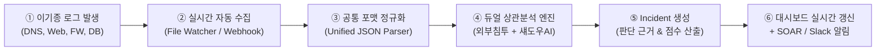

# 🛡️ NexusGuard (넥서스가드)
> **Zero Trust 기반 다기종 로그 상관분석 & 섀도우 AI·IT 거버넌스 자동화 플랫폼**  
> *SKT ALEPH 5개 과목 통합 캡스톤 프로젝트 (4조)*

---

## 📌 1. 프로젝트 개요 (Overview)

**NexusGuard**는 서버, DB, 방화벽 로그와 사내 DNS 질의를 실시간으로 자동 수집하여:
1. **외부 침해 위협:** 외부 해커의 내부 측면 이동(Lateral Movement) 킬체인 추적
2. **내부 유출 위협:** 사내 직원의 미인가 섀도우 AI(ChatGPT 등)를 통한 기밀 데이터 유출을 동시 상관분석하고,
3. **거버넌스 및 SOAR:** LLM 기반 위험도 판별 및 "무조건 차단"이 아닌 **정식 승인(양성화, Sanctioning)** 워크플로를 제공하는 차세대 통합 관제 시스템입니다.

---

## 🏗️ 2. 시스템 아키텍처 및 자동화 파이프라인



---

## 🚨 3. 실제 기업 침해사고 기반 10대 인시던트

| ID | 위험도 | 침해 유형 | 실제 피해 사례 매칭 및 요약 |
| :---: | :---: | :--- | :--- |
| **INC-001** | **CRITICAL** | `LATERAL_MOVEMENT` | **금융 고객 개인정보 2.4만 건 대량 탈취 및 C2 유출** (무차별대입 -> SSH피보팅 -> DB덤프 -> C2유출) |
| **INC-002** | **HIGH** | `SHADOW_AI_EXFILTRATION` | **마케팅팀 미승인 생성형 AI(ChatGPT)를 통한 신규 전략기획서 유출 의심** (DB조회 -> DNS질의 -> API업로드) |
| **INC-003** | **CRITICAL** | `RANSOMWARE_PRECURSOR` | **제조 공정망(OT) 랜섬웨어 선행 단계 비인가 RDP 접속 및 볼륨 섀도우 삭제** (LockBit 유사 패턴) |
| **INC-004** | **HIGH** | `CREDENTIAL_STUFFING_VPN` | **사내 SSL-VPN 인증 정보 탈취 후 Tor 출구 노드 경유 관리자 API 대량 호출** (Impossible Travel) |
| **INC-005** | **HIGH** | `CLOUD_API_KEY_LEAK` | **개발자 GitHub 저장소 AWS IAM Key 노출 및 S3 비정상 대량 다운로드** (82GB 벌크 탈취) |
| **INC-006** | **CRITICAL** | `WEBSHELL_RCE` | **사내 그룹웨어 Log4j 취약점(CVE-2021-44228) 악용 웹쉘 업로드 및 비콘 통신** (Cobalt Strike) |
| **INC-007** | **MEDIUM** | `INSIDER_DATA_THEFT` | **퇴사 예정 연구원의 대용량 WeTransfer 익명 전송을 통한 핵심 소스코드 반출 시도** (420MB 업로드) |
| **INC-008** | **HIGH** | `PHISHING_MACRO_RECON` | **인사평가 위장 피싱 메일 악성 매크로 실행 및 Active Directory(AD) 정찰** (LDAP 대량 질의) |
| **INC-009** | **MEDIUM** | `CRYPTOMINING_INTRUSION` | **사내 유휴 GPU 개발 서버 침투 후 비인가 가상화폐 채굴(Cryptomining) 구동** (Docker 데몬 침투) |
| **INC-010** | **LOW** | `UNAUTHORIZED_PORT` | **외주 협력사 유지보수 단말의 비인가 내부 서브넷 포트 스캔 및 SMB 탐색** (VLAN 이탈) |

---

## 📂 4. 프로젝트 폴더 구조

```
Nexusguard_Git/
├── app.py                      # Streamlit Cloud 루트 엔트리포인트
├── requirements.txt            # 파이썬 의존성 패키지 목록
├── README.md                   # 프로젝트 안내 문서
├── run_demo.py                 # E2E 파이프라인 무결성 검증 스크립트
├── NexusGuard_Notion_Proposal.md # 팀 노션 기획안 원본
├── .gitignore                  # Git 추적 제외 목록
└── nexusguard/                 # 메인 패키지
    ├── schemas/                # Event, Incident, ShadowAI Pydantic 모델
    ├── generators/             # 시나리오 A/B 모의 로그 생성기
    ├── engine/                 # 듀얼 상관분석 & 섀도우 AI 거버넌스 엔진
    ├── storage/                # 인메모리 싱글톤 데이터 저장소
    └── ui/                     # 다크 사이버 테마 Streamlit 대시보드
```

---

## 💻 5. 로컬 실행 방법 (Local Run)

```bash
# 1. 의존성 설치
pip install -r requirements.txt

# 2. 파이프라인 무결성 검증 테스트
python run_demo.py

# 3. 대시보드 실행
streamlit run app.py
```
브라우저에서 `http://localhost:8501`로 접속합니다.

---

## ☁️ 6. Streamlit Community Cloud 무료 배포 가이드

1. 본 폴더의 파일들을 본인의 **GitHub 저장소(Repository)**에 푸시합니다:
   ```bash
   git init
   git add .
   git commit -m "feat: NexusGuard v1.0 initial release"
   git remote add origin https://github.com/<내계정>/<저장소명>.git
   git push -u origin main
   ```
2. **[share.streamlit.io](https://share.streamlit.io)**에 접속하여 GitHub 계정으로 로그인합니다.
3. **[New app]** 클릭 후:
   - **Repository:** `<내계정>/<저장소명>` 선택
   - **Branch:** `main`
   - **Main file path:** `app.py`
4. **[Deploy]** 버튼을 클릭하면 1~2분 내로 무료 공개 URL (`https://<앱이름>.streamlit.app`)이 발급됩니다!
