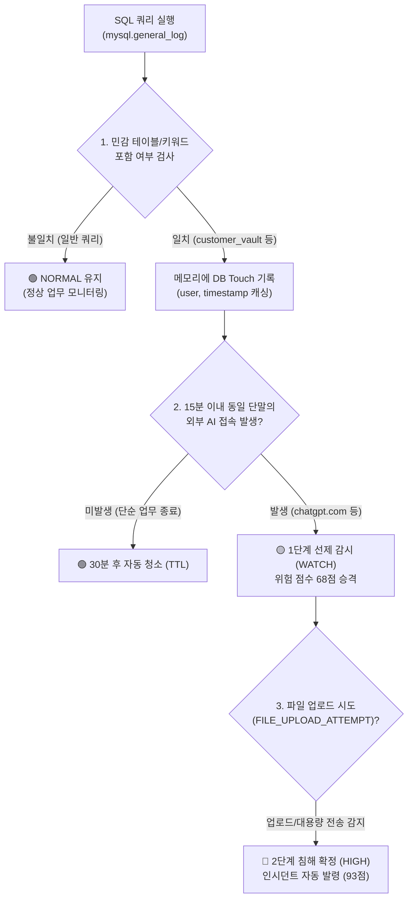

# 🛡️ GIGANG DB 감사 로그(`mysql.general_log`) 테스트 가이드 & 연동 규격

> 💡 **문서 개요**: 본 문서는 MySQL Workbench의 `mysql.general_log`를 활용하여 GIGANG의 **DB 조회 탐지 메커니즘** 및 **2단계 위험 상태 기계(Risk State Machine)**를 테스트하기 위한 실전 가이드입니다. 쿼리 추출 시 발생하는 `BLOB` 문제 해결법, 필수 필드 요건, 권장 파일 포맷(`.csv`)을 상세히 정리했습니다.

---

## 📑 목차
1. [현황 분석: MySQL Workbench 화면 진단과 3대 문제점](#1-현황-분석-mysql-workbench-화면-진단과-3대-문제점)
2. [테스트용 파일 포맷 비교 및 권장안 (.csv vs .xlsx vs .log)](#2-테스트용-파일-포맷-비교-및-권장안-csv-vs-xlsx-vs-log)
3. [GIGANG DB 조회 탐지 및 상관분석 메커니즘](#3-nexusguard-db-조회-탐지-및-상관분석-메커니즘)
4. [실전 튜토리얼: 올바른 SQL 쿼리 및 CSV 추출 3단계](#4-실전-튜토리얼-올바른-sql-쿼리-및-csv-추출-3단계)
5. [테스트 데이터 검증 및 시스템 연동 확인](#5-테스트-데이터-검증-및-시스템-연동-확인)

---

## 1. 현황 분석: MySQL Workbench 화면 진단과 3대 문제점

MySQL의 `mysql.general_log`는 서버에서 실행된 모든 SQL 문장을 실시간으로 기록하는 **표준 쿼리 감사 로그(Query Audit Log)**입니다.  
따라서 **DB 조회 행위를 수집·분석하려는 기본 접근 방식은 100% 적합**합니다.

그러나 **현재 화면(Result Grid)에 보이는 상태 그대로 파일로 저장(Export)하면 시스템이 로그를 전혀 분석하지 못합니다.**

```
[현재 화면의 3대 치명적 한계]
1. argument 컬럼이 BLOB 버튼 상태 ➔ 파일 저장 시 [BLOB] 텍스트나 바이너리로 깨져 저장됨
2. 민감 테이블 쿼리 부재 ➔ customer_vault 등 핵심 키워드가 없으면 일반 쿼리로 간주되어 무반응
3. 계정 및 시간 불일치 ➔ Railway 실시간 에이전트 로그와 사용자/시간(15분 윈도우)이 다르면 결합 실패
```

### 🔍 상세 원인 분석

| 항목 | 화면 상태 | 문제점 및 영향 | 조치 방안 |
| :--- | :--- | :--- | :--- |
| **`argument`** | `BLOB` 버튼 표시 | MySQL Workbench가 `mediumtext`/`blob`을 바이너리로 취급하여 쿼리 본문이 감춰짐. Export 시 `SELECT * FROM...` 텍스트가 유실됨 | SQL 조회 시 `CONVERT(argument USING utf8)` 적용 필수 |
| **조회 대상 테이블** | 불명확 (일반 쿼리) | 탐지 엔진은 `customer_vault`, `corp_strategic_plan` 등 사내 핵심 자산이 조회될 때만 위험도를 승격함 | 테스트용 계정으로 실제 민감 테이블 `SELECT` 쿼리 실행 |
| **`user_host`** | `test_user @ localhost` | 실제 Windows 에이전트(`GIGANGAgent.exe`)가 수집하는 계정명(`User` 또는 사내 계정)과 불일치할 경우 상관분석 불가 | 에이전트 단말의 계정명 및 IP와 일치시키거나 매핑 규칙 정의 |

---

## 2. 테스트용 파일 포맷 비교 및 권장안 (.csv vs .xlsx vs .log)

보안 관제 파이프라인 및 테스트 자동화 관점에서 파일 확장자별 장단점은 다음과 같습니다.

| 파일 형식 | 추천도 | 특징 및 장단점 | GIGANG 적합성 |
| :---: | :---: | :--- | :--- |
| **`.csv` (UTF-8)** | ⭐⭐⭐⭐⭐<br>**(최우선 권장)** | • Workbench에서 **[Export] ➔ CSV**로 1초 만에 생성 가능<br>• Python (`pandas`, `csv`)에서 1줄 코드로 고속 파싱 가능<br>• 텍스트 기반이라 Git 버전 관리 및 육안 검증이 매우 용이함 | **적합도 최상 (적극 권장)** |
| **`.log` (Text Log)** | ⭐⭐⭐⭐<br>**(기본 내장)** | • 현재 `team_collector.py`가 지원하는 `data/activity.log` 형식<br>• `Key=Value` 형태로 SIEM/Syslog 표준과 동일하여 시연 시 리얼리티 우수 | **적합도 우수 (실환경 시연용)** |
| **실제 DB (`.sql`)** | ⭐⭐⭐⭐<br>**(시연용 DB)** | • MySQL 내에 `customer_vault` 테이블을 실제로 생성하고 레코드를 적재해 둔 뒤, 발표 시 직접 쿼리를 날려 실시간 로그를 생성하는 방식 | **최종 시연 발표 시 최고** |
| **`.xlsx` (Excel)** | ❌<br>**(사용 금지)** | • 바이너리 압축 포맷으로 `openpyxl` 등 무거운 종속성 필요<br>• 엑셀 프로그램에서 열려 있으면 파일 잠금(Lock) 에러 발생 | **부적합 (보안 파이프라인 비권장)** |

> 📌 **결론**: 테스트 데이터셋 파일은 **`.csv` (UTF-8)** 형식으로 생성하여 프로젝트의 `data/` 디렉터리에 배치하는 것이 가장 효율적입니다.

---

## 3. GIGANG DB 조회 탐지 및 상관분석 메커니즘

GIGANG 상관분석 엔진(`nexusguard/engine/correlation.py`)은 다음 로직에 따라 DB 이벤트를 처리합니다.



### 🔑 탐지 엔진이 감시하는 핵심 키워드
* **민감 테이블 (`SENSITIVE_TABLES`)**:
  * `customer_vault` (금융 고객 2.4만 건 원장)
  * `customer_info` (사내 고객 개인정보 테이블)
  * `corp_strategic_plan` (신규 사업 전략기획서 원본)
  * `salary_2026` (임직원 연봉 협상 테이블)
  * `secret_key` (API 및 인프라 마스터 암호키)
* **쿼리 문자열 자동 필터링**:
  * 쿼리 텍스트 내에 `customer`, `secret`, `vault`, `plan` 단어가 포함되어 있으면 즉시 민감 DB 접근으로 인식.

---

## 4. 실전 튜토리얼: 올바른 SQL 쿼리 및 CSV 추출 3단계

MySQL Workbench에서 아래 단계를 순서대로 진행하여 완벽한 테스트 CSV를 생성합니다.

### 1단계: 테스트용 민감 테이블 조회 쿼리 실행
먼저 Workbench 쿼리 에디터에서 테스트 쿼리를 실행하여 `general_log`에 기록을 남깁니다.
```sql
-- 테스트 계정으로 민감 DB 조회 실행
SELECT user_id, customer_name, rrn, credit_card_num, balance 
FROM customer_vault 
LIMIT 24500;

-- (또는 전략기획서 조회)
SELECT campaign_strategy, q3_budget_plan 
FROM corp_strategic_plan;
```

---

### 2단계: BLOB 평문 변환 및 표준 필드 추출 SQL 실행
기존의 `FROM mysql.general_log` 대신 **아래 정제 쿼리를 복사하여 실행**합니다.
```sql
SELECT 
    DATE_FORMAT(event_time, '%Y-%m-%dT%H:%i:%s') AS event_time,
    SUBSTRING_INDEX(SUBSTRING_INDEX(user_host, '[', -1), ']', 1) AS user_name,
    '127.0.0.1' AS src_ip,
    'DB_SELECT' AS action,
    'customer_vault' AS target_table,
    CONVERT(argument USING utf8) AS query_string,
    24500 AS rows_affected
FROM mysql.general_log
WHERE command_type = 'Query'
  AND (
      CONVERT(argument USING utf8) LIKE '%customer%'
      OR CONVERT(argument USING utf8) LIKE '%vault%'
      OR CONVERT(argument USING utf8) LIKE '%strategic%'
  )
ORDER BY event_time DESC;
```

---

### 3단계: CSV 파일로 내보내기 (Export)
1. 쿼리 결과창(**Result Grid**) 상단 툴바의 **`Export: [디스켓/표 아이콘]`**을 클릭합니다.
2. 파일 형식을 **`CSV (*.csv)`**로 선택합니다.
3. 파일명을 **`mysql_audit_log.csv`**로 지정하고 프로젝트의 `data/` 폴더에 저장합니다.

#### 📄 완성된 CSV 파일 예시 (`data/mysql_audit_log.csv`)
```csv
event_time,user_name,src_ip,action,target_table,query_string,rows_affected
2026-09-09T19:24:59,test_user,127.0.0.1,DB_SELECT,customer_vault,"SELECT * FROM customer_vault LIMIT 24500;",24500
2026-09-09T19:23:43,normal_user,127.0.0.1,DB_SELECT,corp_strategic_plan,"SELECT campaign_strategy FROM corp_strategic_plan;",150
```

---

## 5. 테스트 데이터 검증 및 시스템 연동 확인

생성된 DB 로그가 GIGANG에서 정상적으로 동작하는지 확인하는 체크리스트입니다.

### ✅ 연동 체크리스트
- [ ] **쿼리 평문 확인**: 추출된 CSV의 `query_string` 컬럼에 `BLOB` 대신 실제 `SELECT * FROM...` 텍스트가 적혀 있는가?
- [ ] **테이블명 일치**: `target_table` 또는 쿼리에 `customer_vault` 등 등록된 민감 키워드가 존재하는가?
- [ ] **계정명 일치**: `user_name`이 실제 접속자(예: `test_user`, `User`, `kim`)와 일치하는가?
- [ ] **시간 동기화**: DB 조회 시점과 Railway 에이전트의 AI 접속 시점이 **15분 이내**인가?

### 🚀 Streamlit 대시보드 검증
1. Streamlit 앱 구동:
   ```bash
   streamlit run nexusguard/ui/app.py
   ```
2. 대시보드 **[종합 관제 화면]**에서 DB 조회가 발생한 사용자가 `WATCH`(68점)로 승격되는지 확인.
3. 이어서 브라우저에서 ChatGPT 접속 및 파일 업로드 시도 시 `HIGH`(93점) 인시던트(`INC-RLY-001`)가 자동 생성되는지 최종 확인.
