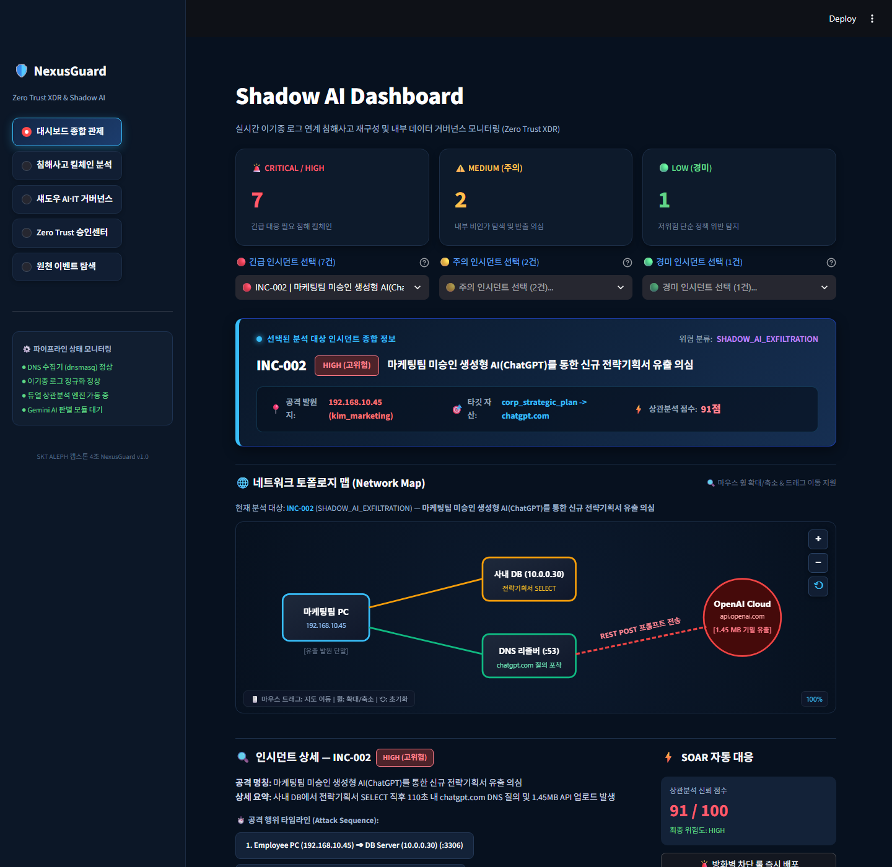
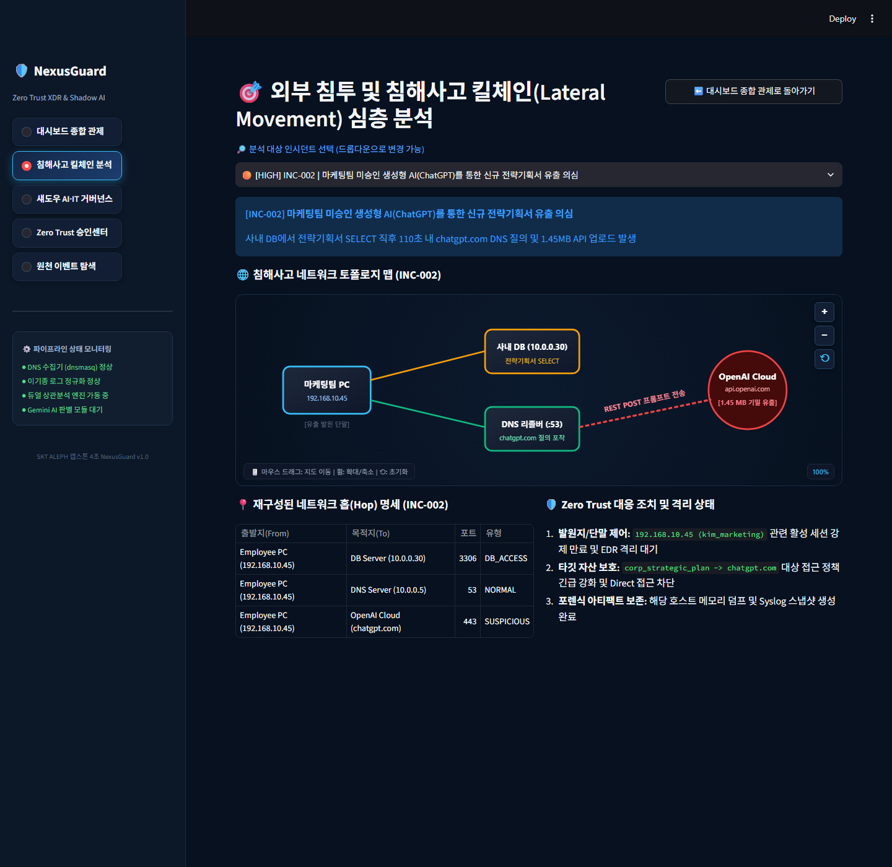
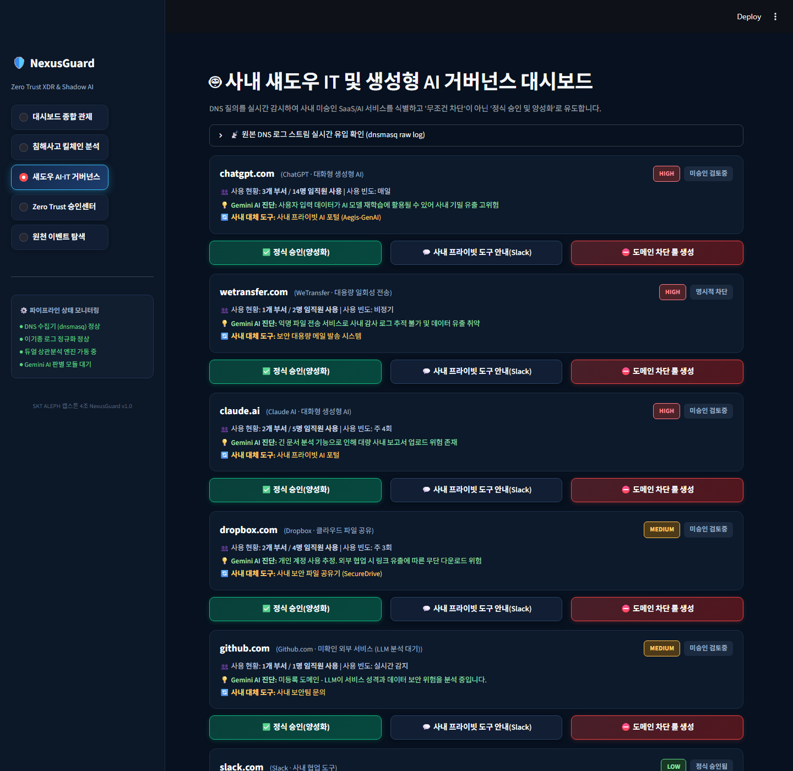
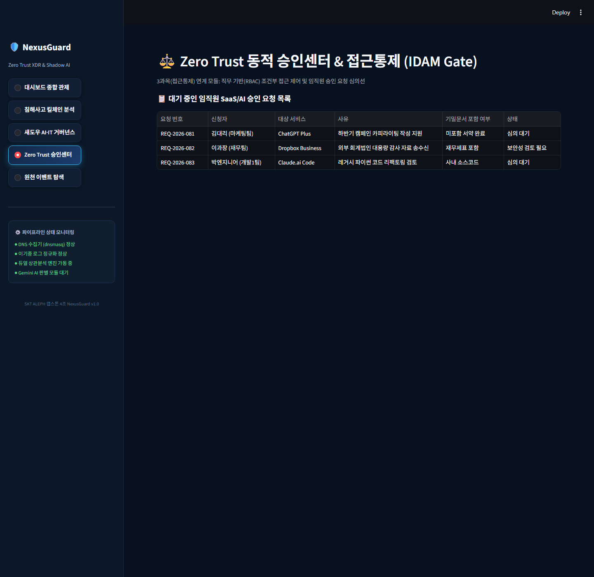
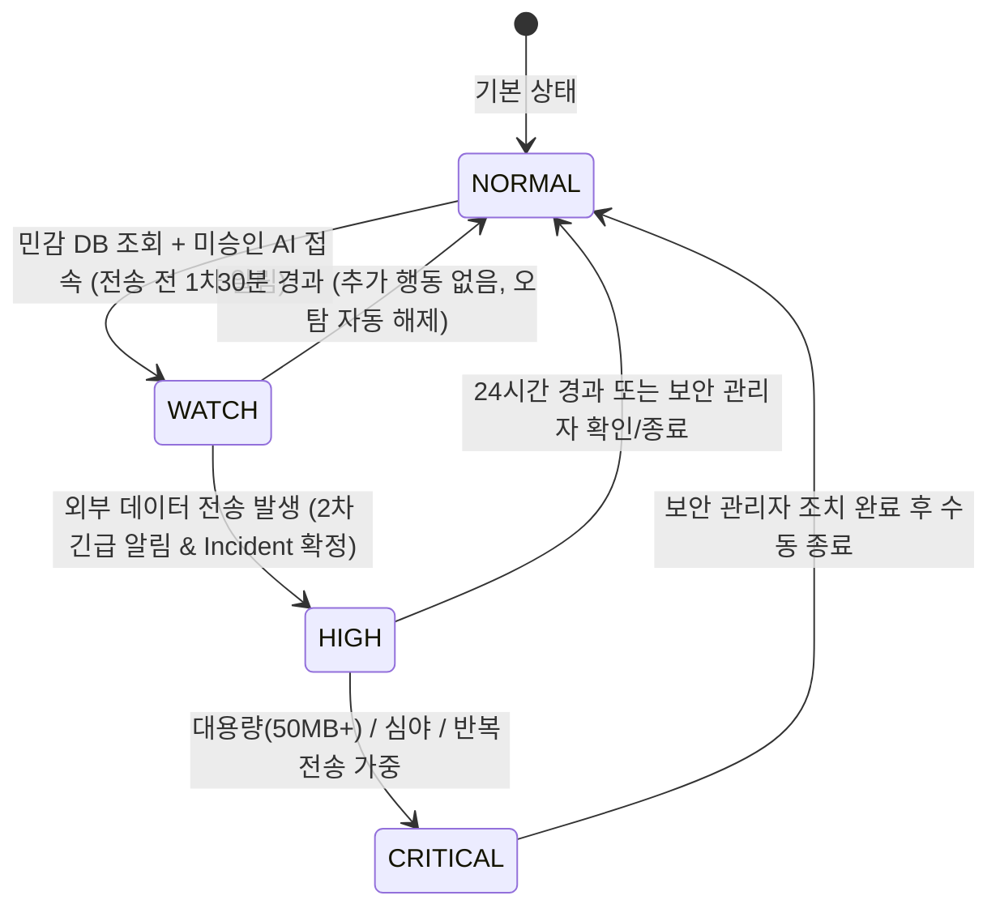
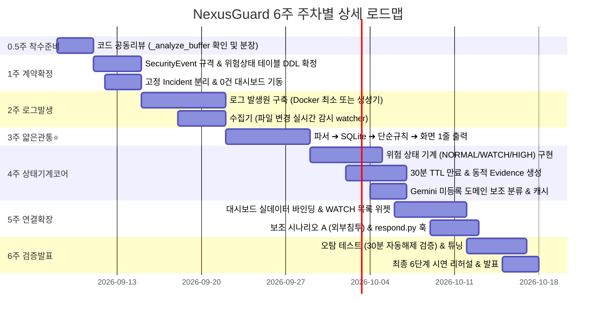

# [기획서 v2.0] NexusGuard 차세대 보안관제 & Shadow AI 2단계 상관분석 시스템

본 문서는 배포 사이트([https://nexusguard-aleph.streamlit.app/](https://nexusguard-aleph.streamlit.app/)) 및 원본 저장소(`dldaudlee36/Nexusguard`), **「원본 개선 요구사항 명세서 (2026-09-05)」**, 그리고 **「위험 상태 기계(Risk State Machine) 설계 보강안」**을 종합하여 수립한 **최종 프로젝트 개선 기획서 및 실행 로드맵**입니다.

---

## 📌 1. User Review Required (핵심 보강 및 의사결정 사항)

> [!IMPORTANT]
> **판단의 2단계 분할: "사후 탐지"에서 "사전 감시(Pre-exfiltration WATCH) + 사후 확정(HIGH)"으로 진화**  
> * **기존 설계의 맹점**: 로그 3개(민감 DB 조회 + 미승인 AI 접속 + 외부 전송)가 모두 수집된 뒤에야 판단하므로, **"이미 외부로 기밀 전송이 끝난 뒤에야 알 수 있는 사후 탐지(Post-facto)"**라는 치명적 한계가 존재했습니다.
> * **보강된 2단계 판단 모델**:
>   1. **전송 이전 (1차 판단)**: `[민감 DB 조회 + 미승인 AI 접속]` 조건 2개가 충족되면, 즉시 사용자를 **`WATCH(감시 대상)`** 상태로 승격시키고 **1차 알림**을 발행하며 대시보드 감시 목록에 노출합니다. ("전송이 일어나기 전에 화면이 먼저 움직임")
>   2. **실제 전송 시 (2차 판단)**: `WATCH` 사용자가 실제 외부 전송을 감행하면 즉시 **`HIGH` Incident로 확정**하고 **2차 알림**을 발행합니다.
> * **비용 및 구현 난이도**: 테이블 2개, 코드 약 80줄, 개발 소요 1~1.5일 수준으로 극히 가벼우며, 과거 로그 조합 탐색(Combinatorial Search)이 불필요해져 **오히려 구현 난이도가 대폭 감소**합니다.

> [!TIP]
> **오탐 자동 해제 안전장치 (WATCH $\rightarrow$ NORMAL 30분 TTL)**  
> * 직원이 DB를 조회한 뒤 단순히 AI 사이트에서 일상 업무 질의만 하고 데이터 전송을 하지 않았다면, **30분(TTL) 경과 후 자동으로 `NORMAL` 상태로 복귀**합니다.
> * 별도 삭제 배치 작업 없이 `expires_at > now` 시간 조건으로 자동 필터링하며, 상태 이력에 복귀 근거가 기록되어 시연 시 **"오탐이 스스로 해제되는 자가 복구 메커니즘"**을 입증할 수 있습니다.

> [!WARNING]
> **Gemini LLM의 엄격한 위치: 의사결정자가 아닌 '데이터 보강(Enrichment) 레이어'**  
> * LLM은 사용자의 위험도를 판단하는 위치에 있지 않습니다. 오직 **"알려지지 않은 미등록 도메인의 유형(생성형 AI, 파일공유 등)과 데이터 재학습 여부"**만 1회 보조 분류하여 라벨을 부착합니다.
> * **캐싱 필수**: 동일 도메인을 재질의하지 않아 비용·지연 시간·재현성을 모두 확보합니다.
> * **무중단 원칙**: LLM API 호출이 실패하거나 키가 없어도 `unknown` 라벨을 달고 파이프라인은 100% 정상 작동합니다.
> * **비차단 원칙**: 정상 업무 차단 사고를 막기 위해, 차단 조건에는 LLM 판단 결과를 절대 포함하지 않고 오직 **실제 로그로 확인된 사실(DB 조회 + 대용량 전송)**만을 사용합니다.

---

## 📸 2. 현행 웹 대시보드 캡쳐 화면 및 화면별 개선/반영 계획

현재 배포 중인 `NexusGuard` 웹 대시보드([nexusguard-aleph.streamlit.app](https://nexusguard-aleph.streamlit.app/))의 실제 화면 4종을 캡쳐하여 분석하고, 이번 개선안에 맞춘 개편 계획을 수립했습니다.

### [화면 1] 대시보드 종합 관제 (Overview)


* **현행 분석**:
  * 다크 테마 기반의 완성도 높은 레이아웃, 상단 3대 KPI 카드(긴급 7, 주의 2, 경미 1), 줌/팬 인터랙티브 SVG 토폴로지 맵, 공격 시퀀스 홉 명세 및 SOAR 버튼이 배치되어 있습니다.
  * 그러나 내부적으로 10건의 Mock 인시던트(`_init_mock_incidents()`)가 하드코딩되어 있고, 상관분석 버퍼 함수(`_analyze_buffer()`)는 비어 있습니다.
* **개선 반영 계획**:
  * **UI 컴포넌트 전면 계승**: 다크 테마 스타일링, KPI 카드, 인터랙티브 SVG 토폴로지 맵 렌더러는 100% 재사용합니다.
  * **0건 빈 화면 시작 (Clean State)**: 운영 모드에서 고정 인시던트를 걷어내고 0건으로 시작합니다.
  * **🌟 [신규 위젯 추가] 실시간 감시 대상 (`WATCH`) 현황판**: 전송 전 단계에 진입한 `WATCH` 사용자 카드(사용자명, 진입 사유, 만료까지 남은 시간, 1차 알림 상태)를 상단에 새롭게 노출하여 선제 탐지 가시성을 극대화합니다.

---

### [화면 2] 침해사고 킬체인(Lateral Movement) 심층 분석


* **현행 분석**:
  * 인시던트별 네트워크 홉 명세(`From ➔ To :Port`)와 Zero Trust 격리 조치를 테이블로 제공합니다.
* **개선 반영 계획**:
  * **보조 시나리오(시나리오 A) 전용 검증 탭으로 명확화**: 외부 공격자의 브루트포스 로그인 성공 $\rightarrow$ 점프서버 피보팅 $\rightarrow$ DB 접근 $\rightarrow$ C2 유출 흐름이 실제 상관엔진에 의해 Incident로 재구성됨을 검증하는 보조 화면으로 유지합니다.

---

### [화면 3] 사내 섀도우 IT 및 생성형 AI 거버넌스 대시보드


* **현행 분석**:
  * DNS 원천 질의 로그 기반으로 사내에서 사용된 SaaS/AI 도메인 목록, Gemini AI 진단, 대체 도구, 승인/차단 버튼을 표시합니다.
* **개선 반영 계획**:
  * **메인 관제 화면으로 승격**: 사내 Shadow AI 및 미승인 서비스 사용 현황을 통제하는 핵심 화면입니다.
  * **정책 DB 연동**: 관리자가 [정식 승인(양성화)] 또는 [도메인 차단]을 누르면 SQLite 정책 테이블에 반영되어, 향후 상관분석 엔진이 도메인을 평가할 때 즉시 반영되도록 양방향 연동을 구현합니다.
  * **Gemini LLM 캐시 연동**: 미등록 도메인 유입 시 LLM 진단 결과를 DB에 캐싱하여 다음부터는 즉시 응답하도록 최적화합니다.

---

### [화면 4] Zero Trust 승인센터 & 접근통제 (MVP 제외)


* **현행 분석**:
  * 임직원의 SaaS/AI 결재 요청 목록을 모의 테이블로 표시하고 있습니다.
* **개선 반영 계획**:
  * **MVP 개발 대상에서 공식 제외**: 인사 시스템(HR), 결재선, RBAC 구현은 4인 6주 프로젝트 범위를 초과하므로 개발을 배제합니다. 사이드바 메뉴는 단순 비활성화하거나 정책 조회용 단순 뷰로 격하시킵니다.

---

## ⚙️ 3. 핵심 설계 ① 위험 상태 기계 (Risk State Machine)

### 3.1 상태 정의 및 전이 규칙

| 상태 | 진입 조건 | 알림 발송 | 만료 주기 (TTL) | 비고 |
| :--- | :--- | :--- | :--- | :--- |
| **`NORMAL`** | 기본 상태 (정상 업무) | 없음 | 영구 | 일반 웹/AI 단순 접속 상태 |
| **`WATCH`** | 전송 제외 조건 2개 동시 충족<br>(민감 DB 조회 + 미승인 AI/클라우드 접속) | **1차 알림**<br>(Slack / 대시보드) | **30분** | **사전 감시 승격 (선제 탐지)**<br>30분 내 추가 행동 없으면 NORMAL 복귀 |
| **`HIGH`** | `WATCH` 상태에서 **외부 데이터 전송 로그** 발생 | **2차 알림**<br>(긴급 경보) | **24시간** | **민감정보 유출 확정 Incident 생성** |
| **`CRITICAL`** | 대용량(예: 50MB 이상) / 야간 / 반복 전송 등 가중치 충족 | 2차 + 비상 알림 | 관리자 수동 종료 | 선택적 가중 구현 (여유 시) |

### 3.2 상태 전이 다이어그램



### 3.3 저장 구조 (SQLite DDL) 및 핵심 알고리즘

만료 처리를 백그라운드 타이머나 무거운 데몬 스레드로 구현하지 않고, **`expires_at` 시각을 저장해두고 조회 시 `WHERE expires_at > CURRENT_TIMESTAMP` 조건으로 필터링**하여 버그를 완벽히 차단합니다.

```sql
-- ① 현재 위험 상태 테이블 (사용자당 1행, Upsert)
CREATE TABLE IF NOT EXISTS user_risk (
    user        TEXT PRIMARY KEY,
    state       TEXT NOT NULL,        -- 'NORMAL', 'WATCH', 'HIGH', 'CRITICAL'
    score       INTEGER DEFAULT 0,
    reasons     TEXT,                 -- JSON Array: ["민감 DB 조회", "미승인 AI 질의"]
    entered_at  DATETIME DEFAULT CURRENT_TIMESTAMP,
    expires_at  DATETIME NOT NULL
);

-- ② 상태 변경 이력 테이블 (감사 로그용, Append-only)
CREATE TABLE IF NOT EXISTS risk_history (
    id          INTEGER PRIMARY KEY AUTOINCREMENT,
    user        TEXT NOT NULL,
    from_state  TEXT NOT NULL,
    to_state    TEXT NOT NULL,
    reason      TEXT,
    at          DATETIME DEFAULT CURRENT_TIMESTAMP
);
```

#### 중복 알림 억제 및 핵심 처리 함수
```python
def update_user_risk(user: str, event: SecurityEvent, db_conn) -> None:
    now_utc = datetime.utcnow()
    # 1. 만료되지 않은 현재 상태 조회
    row = db_conn.execute(
        "SELECT state, score, reasons FROM user_risk WHERE user = ? AND expires_at > ?",
        (user, now_utc)
    ).fetchone()
    old_state = row["state"] if row else "NORMAL"

    # 2. 신규 상태 평가 (상관분석 규칙 적용)
    new_state, score, reasons = evaluate_risk_rules(user, event, old_state)

    # 3. 중복 알림 억제: 상태가 동일하면 만료 시간만 연장하고 리턴
    if new_state == old_state:
        db_conn.execute(
            "UPDATE user_risk SET expires_at = ? WHERE user = ?",
            (now_utc + TTL[new_state], user)
        )
        return

    # 4. 상태가 달라졌을 때만 갱신 및 알림 발행
    expires_at = now_utc + TTL[new_state]
    db_conn.execute("""
        INSERT INTO user_risk (user, state, score, reasons, entered_at, expires_at)
        VALUES (?, ?, ?, ?, ?, ?)
        ON CONFLICT(user) DO UPDATE SET
            state=excluded.state, score=excluded.score, reasons=excluded.reasons,
            entered_at=excluded.entered_at, expires_at=excluded.expires_at
    """, (user, new_state, score, json.dumps(reasons), now_utc, expires_at))

    # 이력 기록 (시연 시 오탐 복귀 증거로 사용)
    db_conn.execute(
        "INSERT INTO risk_history (user, from_state, to_state, reason, at) VALUES (?, ?, ?, ?, ?)",
        (user, old_state, new_state, " / ".join(reasons), now_utc)
    )

    # 1차/2차 알림 발송 (Slack or Dashboard Banner)
    dispatch_alert(user, old_state, new_state, score, reasons)
```

> [!IMPORTANT]
> **엄격한 시간 동기화 규칙 (Timezone Agreement)**  
> * **DB에는 무조건 UTC(`datetime.utcnow()`)로 저장**합니다.
> * 화면(Streamlit) 및 알림에 출력할 때에만 한국 표준시(`KST = UTC+9`)로 변환합니다.
> * 로그가 역순으로 도착할 수 있으므로, 수집된 로그는 **약 5초간 버퍼에 모아 이벤트 timestamp 기준으로 정렬한 뒤 상태 기계에 피딩**합니다.

---

## 🤖 4. 핵심 설계 ② Gemini LLM의 위치와 4대 원칙

### 4.1 파이프라인 상의 보강(Enrichment) 흐름

```mermaid
flowchart TD
    A["실시간 로그 수집"] --> B["SecurityEvent 공통 정규화"]
    B --> C{"웹/DNS 질의 이벤트인가?"}
    C -->|아니오| G["상태 기계 상관분석"]
    C -->|예| D{"사내 정책 DB에 등록된 도메인인가?"}
    D -->|등록됨 (승인/차단)| G
    D -->|미등록 신규 도메인| E{"로컬 LLM 캐시에 존재하는가?"}
    E -->|캐시 Hit| F["카테고리 라벨 부착"]
    E -->|캐시 Miss| H["Gemini API 비동기 질의\n(도메인 성격 & 재학습 여부 진단)"]
    H -->|결과 수신| I["도메인 캐시 저장"]
    H -->|장애/실패| J["unknown 라벨 부착 (무중단 통과)"]
    I & J --> F
    F --> G
    G --> K["user_risk 상태 전이 (NORMAL ➔ WATCH ➔ HIGH)"]
```

### 4.2 대상과 책임의 엄격한 분리
* **Gemini LLM의 대상**: 단일 도메인 문자열 (`"이 사이트(domain)가 무슨 용도인가?"`) $\rightarrow$ 메타데이터 부착
* **상관분석 엔진의 대상**: 특정 사용자의 시간순 다중 로그 (`"이 사람(user)이 유출 행위를 하는가?"`) $\rightarrow$ 위험도 결정

### 4.3 LLM 구현 4대 원칙
1. **도메인 캐시 필수**: 한 번 진단한 도메인은 로컬 DB/파일에 영구 캐시하여 중복 API 비용을 0으로 만들고 재현성(Determinism)을 확보합니다.
2. **장애 격리 (Fail-open)**: API 키가 없거나 네트워크 오류 시 즉시 `unknown`으로 분류하고 통과시킵니다. LLM 장애가 전체 보안 관제를 멈추게 하지 않습니다.
3. **실시간 경로 비차단**: 캐시에 없는 도메인은 백그라운드 스레드에서 조회하고 메인 스트림을 지연시키지 않습니다.
4. **차단 조건 절대 배제**: LLM 환각으로 인한 정상 업무 마비를 방지하기 위해, 자동차단 및 긴급 격리 조건에는 LLM 분류를 넣지 않습니다.

---

## ⚡ 5. 핵심 설계 ③ 대응 훅 (SOAR 확장 포인트)

파이프라인 마지막 단계에 단일 진입점 함수(`respond.py`)를 미리 확보하여, 향후 확장이 필요할 때 기존 코드를 전혀 수정하지 않고 조치 액션을 추가할 수 있도록 설계합니다.

```python
# src/engine/respond.py (SOAR 훅 진입점)

def on_risk_state_changed(user: str, old_state: str, new_state: str, incident=None):
    """위험 상태 전이 시 자동 호출되는 범용 훅"""
    if new_state == "WATCH":
        # 1차 알림 (감시 대상 승격 통보)
        send_slack_watch_alert(user)
        # log_to_dashboard_banner(user, "감시 대상 등록")

    elif new_state == "HIGH":
        # 2차 알림 (긴급 침해사고 전파)
        send_slack_incident_alert(incident)
        
        # [SOAR 확장 포인트 - 주석 해제만으로 즉시 연동]
        # block_outbound_transfer(incident.dst_ip, incident.dst_port) # 방화벽 차단
        # revoke_user_sso_session(user)                              # 세션 만료
```

---

## 📅 6. 6주 상세 실행 계획 (얇은 관통 Thin-Slice 로드맵)

"각자 개발 후 5주차에 처음 합치는 방식"을 지양하고, **3주차에 로그 1줄이 수집부터 화면 출력까지 끝까지 흐르는 얇은 관통(Thin-Slice)**을 완성합니다.



### 팀원 4인 역할 분담 (R&R)
| 역할 | 담당 모듈 | 주요 산출물 | 완료 판정 기준 |
| :--- | :--- | :--- | :--- |
| **① 인프라 & 수집** | `src/collector/` | 로그 발생 환경(Docker 최소 or 생성기) + `watcher.py` 실시간 수집 데몬 | 명령어 하나로 실제 로그 파일에 줄이 쌓이고 수집기가 감지 |
| **② 파싱 & 저장** | `src/normalizer/`, `src/storage/` | Auth/DB/DNS/FW 정규식 파서 + `SecurityEvent` 규격 + SQLite 스키마(`user_risk`, `risk_history`) | 원본 로그 1줄이 단일 JSON으로 정규화되어 DB에 저장 |
| **③ 상관분석 (코어)** | `src/engine/` | 상태 기계 (`update_user_risk`) + 2대 상관분석 + 동적 Evidence + Gemini 캐시 | `WATCH` 1차 및 `HIGH` 2차 전이가 정확히 발생하고 근거가 생성 |
| **④ UI & 발표** | `src/dashboard/` | Streamlit 실데이터 연동 + 감시 대상(`WATCH`) 위젯 + 네트워크 맵 바인딩 + 테스트 | 화면에 실시간 감시 카드와 인시던트가 동적으로 표출 |

---

## 🎬 7. 최종 6단계 시연 시나리오 (Demonstration Flow)

최종 시연 발표 시 평가위원에게 보여줄 결정적 6단계 시나리오입니다.

1. **[1단계: 오탐 방지 입증] AI 사이트 단순 접속**  
   직원이 ChatGPT에 접속하여 일상 업무 질문을 수행 $\rightarrow$ 로그는 정상 수집되지만, 사전 DB 조회가 없으므로 **경보(Incident)가 전혀 발생하지 않음**을 보여줌. ("모든 AI 접속을 유출로 몰지 않는다")
2. **[2단계: 핵심 차별화] 민감 DB 조회 + 미승인 AI 접속 $\rightarrow$ `WATCH` 승격 (선제 감시)**  
   직원이 고객 DB를 SELECT한 직후 미승인 AI 사이트에 접속 $\rightarrow$ **데이터 전송을 아직 하지 않았는데도** 대시보드 상단에 **"실시간 감시 대상(WATCH) 1명"** 카드가 출현하고 1차 알림 발송. ("사후 탐지가 아니라 전송 전에 이미 감시가 시작된다")
3. **[3단계: 유출 확정] 외부 대용량 전송 감행 $\rightarrow$ `HIGH` Incident 확정**  
   `WATCH` 사용자가 48MB 파일 업로드를 실행 $\rightarrow$ 1~2초 내에 **`HIGH` 인시던트로 확정 승격**되고 2차 긴급 알림 발송.
4. **[4단계: 설명 가능한 보안] 동적 근거(Evidence) 확인**  
   대시보드 인시던트 카드에서 "어떤 사용자 / 어떤 DB 테이블 조회 / 어떤 외부 도메인 / 몇 MB 전송인지" 4종의 실시간 결합 근거 확인.
5. **[5단계: 안전장치 입증] 오탐 자동 해제 (Self-healing TTL)**  
   또 다른 테스트 사용자가 조건 일부만 건드리고 전송 없이 30분이 경과 $\rightarrow$ `risk_history`에 `WATCH ➔ NORMAL (30분 경과, 추가 행동 없음)` 로그가 찍히며 대시보드 감시 목록에서 조용히 사라지는 장면 시연.
6. **[6단계: 보조 검증] 외부 침투 킬체인 시연**  
   외부 공격자의 무차별 대입 및 내부 횡적이동 로그를 투입하여 동일한 상관엔진이 침투 킬체인 인시던트도 완벽히 잡아냄을 증명.

---

## 🛑 8. 범위 선 긋기 (일정 지연 시 축소 우선순위)

일정이 촉박해질 경우 아래 순서대로 과감히 쳐냅니다.

```text
[버릴 수 있는 순서] (우측부터 제거)
CRITICAL 상태  ➔  Docker (로그 생성기 대체)  ➔  Slack 연동  ➔  시나리오 A (외부 침투)  ➔  Gemini LLM 보조분류
========================================================================================
[절대 버리면 안 되는 핵심 코어]
★ 상관분석  |  ★ 위험 상태 기계 (WATCH/HIGH)  |  ★ 동적 Evidence  |  ★ 오탐 테스트 (30분 해제)
```
